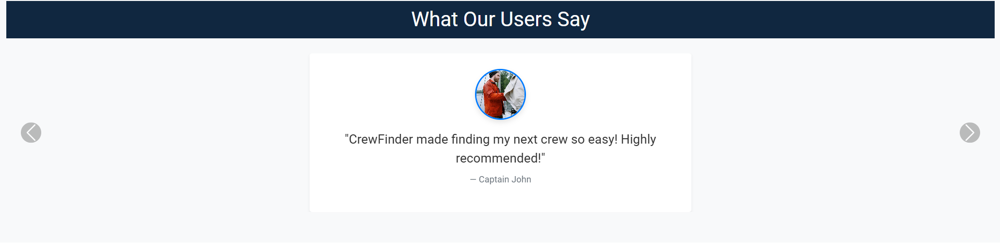
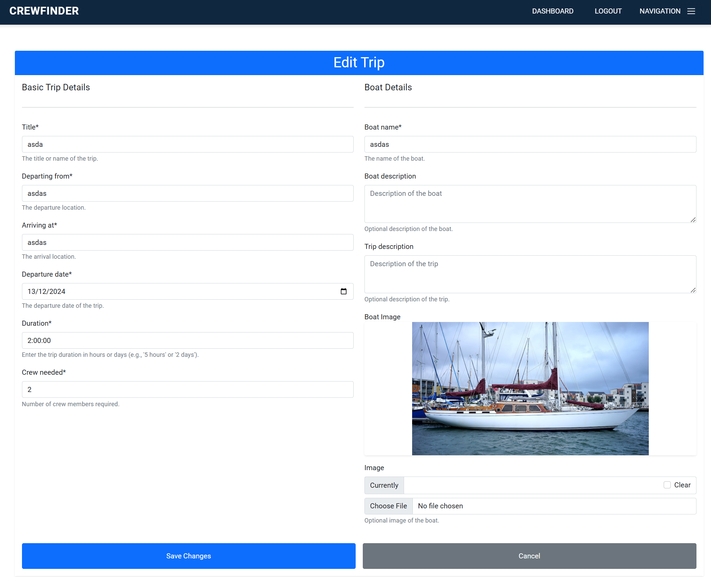
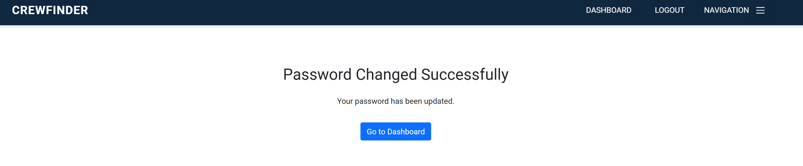

# CrewFinder

**CrewFinder** is a fictitious platform designed to connect captains and crew members in the sailing community. Whether you're a captain searching for crew to join your voyage or a sailor looking for exciting opportunities on the water, CrewFinder helps bring people together. With its simple and intuitive design, the platform makes it easy to create or apply for sailing trips.

This project was developed as part of a portfolio to showcase full-stack development skills. While it’s not a real application, CrewFinder demonstrates how captains and crew members could collaborate effortlessly through features like trip listings, applications, and profile management. Explore the possibilities of what such a platform could achieve!

The live link can be found here - [CrewFinder](https://crew-finder-410f29f97c51.herokuapp.com/)


<div style="display: flex; justify-content: center; align-items: center; gap: 20px;">
  
</div>


# Table of contents

- [CrewFinder](#crewfinder)
- [Table of contents](#table-of-contents)
  - [The Approach I Took](#the-approach-i-took)
  - [Design](#design)
    - [Color Scheme](#color-scheme)
    - [Imagery](#imagery)
    - [Fonts](#fonts)
    - [Wireframes](#wireframes)
  - [Agile Methodology](#agile-methodology)
    - [User Stories](#user-stories)
  - [Data Model](#data-model)
    - [Defined Relationships](#defined-relationships)
  - [Testing](#testing)
  - [Security Features and Defensive Design in CrewFinder](#security-features-and-defensive-design-in-crewfinder)
    - [**Authentication and Authorization**](#authentication-and-authorization)
    - [**Input Validation and Defensive Design**](#input-validation-and-defensive-design)
    - [**Sensitive Data Management**](#sensitive-data-management)
    - [**UI and Defensive Design**](#ui-and-defensive-design)
    - [**Security Best Practices**](#security-best-practices)
  - [Project - CrewFinder](#project---crewfinder)
  - [My Apps](#my-apps)
    - [Accounts App](#accounts-app)
    - [Crewbooking App](#crewbooking-app)
    - [Pages App](#pages-app)
    - [Trips App](#trips-app)
  - [Features](#features)
    - [Navigation Bar](#navigation-bar)
    - [Footer](#footer)
  - [Home Page](#home-page)
    - [Home page hero section](#home-page-hero-section)
    - [Home page about crewfinder](#home-page-about-crewfinder)
    - [Home page about sailing opportunities](#home-page-about-sailing-opportunities)
    - [Home page call to action](#home-page-call-to-action)
    - [Home page testimonials](#home-page-testimonials)
  - [Signup Page](#signup-page)
  - [Thank you for registering page](#thank-you-for-registering-page)
  - [Bio Completion Page](#bio-completion-page)
  - [Login Page](#login-page)
  - [Reset Password Page](#reset-password-page)
  - [About Us Page](#about-us-page)
    - [About Us Hero Image](#about-us-hero-image)
    - [About Us Our Mission](#about-us-our-mission)
    - [About Us Reasons](#about-us-reasons)
    - [About Us Pitch](#about-us-pitch)
  - [Contact Us Page](#contact-us-page)
    - [Contact Us Form](#contact-us-form)
  - [Sailing Opportunities Page](#sailing-opportunities-page)
  - [Dashboards](#dashboards)
    - [Admin Dashboard](#admin-dashboard)
    - [Captains Dashboard](#captains-dashboard)
    - [Crew Dashboard](#crew-dashboard)
    - [User Profile Form](#user-profile-form)
    - [Change Password Form](#change-password-form)
  - [Deployment - Heroku](#deployment---heroku)
    - [Create the Heroku App:](#create-the-heroku-app)
    - [Attach the Postgres database:](#attach-the-postgres-database)
    - [Prepare the environment and settings.py file:](#prepare-the-environment-and-settingspy-file)
    - [Create files / directories](#create-files--directories)
    - [Update Heroku Config Vars](#update-heroku-config-vars)
    - [Deploy](#deploy)
  - [Forking this repository](#forking-this-repository)
  - [Cloning this repository](#cloning-this-repository)
  - [Languages](#languages)
  - [Frameworks - Libraries - Programs Used](#frameworks---libraries---programs-used)
  - [Credits](#credits)
- [Documentation of Resources Used for the CrewFinder App](#documentation-of-resources-used-for-the-crewfinder-app)
  - [Resources and References](#resources-and-references)


## The Approach I Took
<details>

 <summary>Welcome</summary>


</details>

<details>

 <summary>Agenda</summary>


</details>
<details>

 <summary>Introduction</summary>


</details>
<details>

 <summary>The Problem</summary>


</details>
<details>

 <summary>Target Audience</summary>


</details>
<details>

 <summary>Persona 1 - Captain</summary>


</details>
<details>

 <summary>Persona 2 - Crew</summary>


</details>
<details>

 <summary>Persona 2 - Crew</summary>


</details>
<details>

 <summary>Proposed Solution</summary>


</details>
<details>

 <summary>I Will Deliver</summary>


</details>
<details>

 <summary>Process Flow</summary>


</details>
<details>

 <summary>README</summary>


</details>
<details>

 <summary>Testing</summary>


</details>

## Design
The design of the site is clean and simple. It features colours and imagery supporting the marine theme.
The imagery reflects the target audience and the experience of crew and captains on trips.

### Color Scheme


The colours were picked to reflect and complement the marine nature of the site theme.

### Imagery
The images selected for the site theme are used to reflect the target audience. The are meant to create an excitement about the sailing experince.

### Fonts
Robot has been chosed as the primary font with sans-serif as the backup should the primary not load correctly.


### Wireframes

<details>

 <summary>Home Page</summary>


</details>
<details>

 <summary>About Us</summary>


</details>
<details>

 <summary>Contact Us</summary>


</details>

<details>

 <summary>Login</summary>


</details>

<details>

 <summary>Signup</summary>


</details>

<details>

 <summary>Admin Dashboard</summary>


</details>

<details>

 <summary>Captains Dashboard</summary>


</details>

<details>

 <summary>Crew Dashboard</summary>


</details>

<details>

 <summary>Update Profile Form</summary>


</details>
<details>

 <summary>Complete Profile Form</summary>


</details>


## Agile Methodology
I used Github to manage the development process using an agile approach.

I used two views, Kanban and a table to view progress.

[Kanban](https://github.com/users/doyle-kfd/projects/2/views/1)

[Table View](https://github.com/users/doyle-kfd/projects/2/views/2)

### User Stories

#### EPIC | User Registration, Approval And Authentication
- As a user, I want to register for an account with the option to select my role as either a captain or a crew member so that I can specify my participation in trips.

  - AC-1 The registration form includes fields for username, email, password, and role selection.
  - AC-2 Role selection is limited to "Captain" or "Crew."
  - AC-3 After successful registration, the user sees a message indicating that their account is pending admin approval.

- As an admin, I want to review new account registrations and approve or disapprove them so that only validated users can access the platform.

  - AC-1 Admin dashboard lists all pending accounts.
  - AC-2 Approved users are notified and gain access to the platform to complete their profile; disapproved users receive a notification.

- As an approved user, I want to complete my profile by adding information about my experience level and a bio, so that others can understand my skills and background.

  - AC-1 After admin approval, the user gains access to the profile setup page.
  - AC-2 The profile form includes fields for experience level and a bio.
  - AC-3 Form is styled using Crispy Forms and Bootstrap.
  - AC-4 Data saves successfully to the profile, and changes are visible on the dashboard.

- As an approved user, I want to view my profile on my dashboard, so I can see the information I’ve shared and make updates as needed.

  - AC-1 Dashboard displays user profile with fields for bio and experience level.
  - AC-2 The Edit option is available to update profile details.
  - AC-3 Changes save and update immediately upon submission.

- As a returning user, I want to log in and log out of my account securely to access my profile and trip features.

  - AC-1 The login form includes fields for email/username and password, with clear labels for each.
  - AC-2 Upon successful login with valid credentials, the user is redirected to their dashboard.
  - AC-3 A Logout link is available in the navigation bar when the user is logged in.
  - AC-4 Upon logging out, the user is redirected to the homepage.
  - AC-5 If a logged-out user tries to access a restricted page (e.g., dashboard or profile), they are redirected to the login page.


#### EPIC | Trip Management

- As a captain, I want to create a sailing trip with details like title, location, date, and the number of crew needed, so I can recruit crew members for specific journeys.

  - AC-1 The trip creation form is only accessible to users with the "Captain" role.
  - AC-2 Form includes fields for title, location, date, and crew needed.
  - AC-3 Created trip appears on the captain’s dashboard under "My Trips."

- As a captain, I want to view a list of my created trips, so I can manage my upcoming trips and review participant status.

  - AC-1 Dashboard lists all trips created by the captain, sorted by date.

- As a captain, I want to view detailed information about each trip I create, including a list of crew members who have joined, so I can manage and organize my crew effectively.

  - AC-1 The Trip Details page displays trip information and a list of confirmed crew members.
  - AC-2 Option to approve or reject crew requests (if applicable).

#### EPIC | Joining Trips

- As a crew member, I want to view a list of available sailing trips, so I can decide which ones I’d like to join.

  - AC-1 Page that displays a list of trips with open crew positions.
  - AC-2 Each trip entry includes title, location, date, and an option to request to join.

- As a crew member, I want to request to join a specific sailing trip, so I can participate and gain more experience.

  - AC-1 The join request option is available for crew members on the trip details page.
  - AC-2 Request updates the trip’s participant list as "Pending."
  - AC-3 Confirmation of successful join request appears on-screen.

- As a crew member, I want to view the trips I’ve joined on my dashboard, so I can keep track of my participation.

  - AC-1 Dashboard includes a "My Trips" section listing trips the user has joined.
  - AC-2 Trip status (e.g., Pending, Confirmed) displays for each entry.

- As a user, I want my experience to be tailored based on my role (captain or crew), so I only see actions and views relevant to my role.

  - AC-1 Captains have access to trip creation, management, and crew approval features.
  - AC-2 Crew members have access to trip browsing and join request features.
  - AC-3 Unauthorized users are redirected if attempting restricted actions.

#### EPIC | Role Based Access Control

- As an admin, I want to manage user roles effectively, so I can control access to specific features.

  - AC-1 The admin panel includes options to view and modify user roles.
  - AC-2 Role changes are saved and take immediate effect on user permissions.

- As a user, I want my experience to be tailored based on my role (captain or crew), so I only see actions and views relevant to my role.

  - AC-1 Captains have access to trip creation, management, and crew approval features.
  - AC-2 Crew members have access to trip browsing and join request features.
  - AC-3 Unauthorized users are redirected if attempting restricted actions.

#### EPIC | Platform UI And Testing

- As a user, I want rich-text capabilities in my profile bio, so I can add more detailed information about myself.

  - AC-1 Bio field on the profile form supports rich-text formatting via Summernote.
  - AC-2 Bio content displays properly in the profile view on the dashboard.

- As a user, I want the platform to have a clean and intuitive layout with easy navigation, so I can find features and complete actions quickly.

  - AC-1 Consistent styling across pages using Bootstrap and Crispy Forms.
  - AC-2 Navigation bar with links to key sections (dashboard, profile, trips).
  - AC-3 All pages are mobile-friendly and responsive.

#### EPIC | Static Pages

- As a visitor, I want an "About Us" page that describes the purpose of CrewFinder and the benefits of joining, so I can learn more about the platform.

  - AC-1 About Us page includes information on CrewFinder’s mission, team, and features.
  - AC-2 Page is accessible from the navigation bar for all users.

- As a visitor, I want to see a welcoming home page that provides an overview of the CrewFinder platform, so I can understand the purpose and features of the app.

  - AC-1 Home page includes a brief description of CrewFinder, a call-to-action to join, and links to key pages (About Us, Sailing Opportunities, Contact Us).
  - AC-2 Accessible from the navigation bar and visible to all users, including non-logged-in visitors.

- As a visitor, I want a "Contact Us" page where I can find information on how to reach CrewFinder’s team, so I can ask questions or get support.

  - AC-1 Contact Us page includes a contact form with fields for name, email, and message, along with any relevant contact details.
  - AC-2 Submitting the form sends a message to the CrewFinder team and displays a confirmation to the user.

#### EPIC | Dynamic Pages

- As a visitor, I want to see a welcoming home page that provides an overview of the CrewFinder platform and displays the three latest trips, so I can see current opportunities and understand the purpose of the app.

  - AC-1 Home page includes a description of CrewFinder and links to key pages (About Us, Sailing Opportunities, Contact Us).
  - AC-2 The three latest trips are displayed dynamically, showing title, location, date, and a link to the trip details.
  - AC-3 Accessible from the navigation bar and visible to all users, including non-logged-in visitors.

- As a visitor, I want to view a "Sailing Opportunities" page with a list of all available trips, so I can browse sailing options before signing up.

  - AC-1 Sailing Opportunities page lists all active trips, showing titles, locations, dates, and number of crew needed.

- As a visitor, I want a login page where I can enter my credentials to access the platform, so I can reach my account and profile.

  - AC-1 Login page includes fields for email/username and password, along with a “Forgot Password?” option.
  - AC-2 Successful login redirects to the user dashboard.

#### EPIC | Deployment And Testing

- As a developer, I want to deploy the app to Heroku frequently, so I can verify that each feature works as expected in a production-like environment.

  - AC-1 Initial deployment to Heroku occurs on Day 1.
  - AC-2 Subsequent features are deployed to Heroku and verified after implementation.

- As a developer, I want to configure Whitenoise for static file handling, so I can manage CSS and JavaScript assets effectively in production.

  - AC-1 Whitenoise is installed and configured to handle static files on Heroku.
  - AC-2 Static assets load correctly and are accessible in the production environment.

- As a developer, I want to write unit tests for critical models and views, so I can ensure the app behaves as expected.

  - AC-1 Key models (e.g., Account, SailingTrip, CrewBooking) have associated unit tests.
  - AC-2 Critical views (e.g., registration, trip creation) are tested for expected behaviour.


## Data Model

I used principles of Object-Oriented Programming throughout this project and Django’s Class-Based Generic Views.

Django AllAuth was used for the user authentication system.

### Defined Relationships


**User to Trip:**
A User can be a Captain for multiple Trips.

User.id to Trip.captain_id with a 1 to many relationship.

**Trip to CrewBooking:**
A Trip can have multiple CrewBooking records.

Trip.id to CrewBooking.trip_id with a 1 to many relationship.

**User to CrewBooking:**
A User (Crew) can apply to multiple Trips via CrewBooking.

User.id to CrewBooking.user_id with a 1 to many relationship.

#### The CrewFinder ERD Model:


## Testing

#### Testing And Results Can Be Found [here](/TESTING.md)


## Security Features and Defensive Design in CrewFinder

In the CrewFinder app, several measures have been implemented to ensure both security and defensive design. These strategies protect user data, enforce role-based permissions, and guard against invalid or malicious actions.

---

### **Authentication and Authorization**

1. **Role-Based Access Control**:
   - Specific features are restricted to users with the appropriate role:
     - Only captains can create, edit, and delete trips.
     - Only crew members can apply for trips.
     - Admin users have additional permissions to manage user accounts.
   - Role-based checks are implemented in views, using the user’s `role` field.

2. **Login Requirement**:
   - The `@login_required` decorator is used to restrict access to key views like trip creation, editing, and the captain dashboard.
   - Unauthorized users are redirected to the login page.

3. **Account Activation**:
   - New user accounts are set to `is_active=False` by default until approved by an admin, preventing unauthorized access before vetting.

4. **Admin Approval Workflow**:
   - Admins must explicitly approve user accounts and can update the approval status of users before they are fully activated.
   - Only approved users can access key application features.

---

### **Input Validation and Defensive Design**

1. **Form Validation**:
   - Forms, such as `TripCreationForm`, validate user inputs:
     - The `duration` field ensures natural language inputs like "5 hours" or "2 days" are converted into a valid `timedelta` object.
     - Numeric fields like `crew_needed` are restricted to positive integers.
   - Custom widgets and placeholders provide clear guidance to users for proper input.

2. **Backend Validation**:
   - Input validation is performed server-side to ensure data integrity, even if frontend validation is bypassed.
   - Invalid or incomplete submissions raise appropriate errors and prevent database corruption.

3. **Confirmation Steps**:
   - Deletion actions, like trip removal, require a confirmation step to avoid accidental data loss.

4. **Error Handling**:
   - Unauthorized access attempts are met with appropriate error responses, such as `PermissionDenied` or 404 errors, without exposing sensitive details.
   - Graceful failure messages inform users when they attempt invalid actions (e.g., accessing a trip they don’t own).

---

### **Sensitive Data Management**

1. **Environment Variables**:
   - Sensitive credentials (e.g., database credentials, email configuration) are stored in `env.py` and excluded from version control using `.gitignore`.
   - This ensures these details are not accidentally exposed in the public repository.

2. **Media Security**:
   - Profile and trip images are securely stored using Cloudinary, ensuring proper access control and efficient management.

---

### **UI and Defensive Design**

1. **Role-Specific Dashboards**:
   - The captain dashboard only displays trips created by the logged-in captain and crew applications for those trips.
   - Crew members see a personalized dashboard with their applied trips and application statuses.

2. **Fallbacks for Missing Data**:
   - Default images are displayed for trips and profiles when no custom image is uploaded, ensuring a polished UI.
   - Forms provide placeholders and help text to guide users in entering valid information.

3. **Feedback Mechanisms**:
   - Clear success and error messages are displayed to inform users of the result of their actions (e.g., “Trip created successfully”).

---

### **Security Best Practices**

1. **Restricting Permissions**:
   - The `Trip` model ensures only captains can create and manage trips.
   - Signals update the `crew_needed` count dynamically, avoiding unauthorized data manipulation.

2. **Preventing Unauthorized Actions**:
   - Views check ownership before allowing updates or deletions of trips.
   - The `get_object_or_404` method prevents direct URL manipulation to access unauthorized resources.

3. **Session Security**:
   - Django’s session framework protects against session hijacking and CSRF attacks.
   - CSRF tokens are included in all forms.

---

#### **Summary**

By combining authentication, role-based access control, form validation, error handling, and secure data management, the CrewFinder app effectively implements security features and defensive design principles. These measures ensure a reliable and user-friendly experience while safeguarding user data and application integrity.

## Project - CrewFinder

<details>

<summary>urls</summary>

###### `crewfinder/urls.py`

###### `CrewFinder URL Configuration`

###### Overview

This module defines the URL routing for the CrewFinder project. The `urlpatterns` list directs HTTP requests to the appropriate views for handling the core functionalities of the application.

###### Key Functionalities:
1. **Route HTTP requests**: Directs requests to views defined in various apps.
2. **Handle static and media files**: Configures static and media files handling in development mode.
3. **Define custom error handlers**: Provides custom error pages for common HTTP errors (404, 403, 400, 500).
4. **Integrate third-party authentication**: Configures Django Allauth for user authentication and custom account management.

---

###### Example URL Patterns:

###### **Function-Based Views**:
```python
from my_app import views
urlpatterns = [path('', views.home, name='home')]
```

###### **Class-Based Views**

Class-based views (CBVs) provide a more structured way to define views in Django by using Python classes instead of functions. CBVs allow for reusable and extendable views, providing a cleaner and more modular structure for handling HTTP requests.

###### Example:

```python
from other_app.views import Home
urlpatterns = [path('', Home.as_view(), name='home')]
```

###### **Description**

The `Home.as_view()` method converts the `Home` class into a view function that can be used in URL patterns. This approach is beneficial for creating views that involve more complex logic or multiple methods (e.g., GET, POST).


###### **Key Features**

- **Encourages Reusable and Extendable Views**: Class-based views provide a clean, reusable structure for creating views that can be extended or modified as needed.
- **Supports Handling Multiple HTTP Methods**: CBVs allow handling different HTTP methods (such as `GET`, `POST`, etc.) within a single class, reducing code duplication and making it easier to maintain complex views.
- **Ideal for Views with More Complex Logic and Functionality**: Class-based views are particularly useful when a view requires more sophisticated logic, such as processing forms, querying databases, or interacting with other components.

###### **Including Other URL Configurations**

Django allows you to include URL configurations from other apps to maintain modularity and separation of concerns. This is useful for organizing the URL routing of large projects, allowing each app to define its own URL patterns.

###### Example:
```python
from django.urls import include
urlpatterns = [path('blog/', include('blog.urls'))]
```

###### **Description**

The `include()` function references another URL configuration file (e.g., `blog.urls`) and includes its patterns in the main URL configuration. This helps maintain a clean structure where each app handles its own routing.

###### **Key Features**

- **Modular URL Routing**: Allows each app to define its own routing, ensuring that the main URL configuration remains clean and manageable.
- **Simplifies Project Growth**: As the project grows, you can easily add new functionality and routing by including URL configurations from new apps.
- **Maintainability**: By keeping app-specific URLs separate, the project remains easier to maintain and extend.

###### **URL Routing Implementation**

This section defines the URL patterns and routing logic for the CrewFinder project. It configures how HTTP requests are mapped to views and includes different URL configurations from various apps to handle project-specific functionalities.

###### Example:
```python
from django.contrib import admin
from django.urls import path, include
from django.conf.urls.static import static
from django.conf import settings
from django.contrib.auth import views as auth_views
from accounts.views import CustomLogoutView
from pages import views as pages_views

# Custom error handlers
handler404 = 'pages.views.custom_404_view'
handler403 = 'pages.views.custom_403_view'
handler400 = 'pages.views.custom_400_view'
handler500 = 'pages.views.custom_500_view'

urlpatterns = [
    path('admin/', admin.site.urls),  # Admin panel for site administration
    path('accounts/login/',  auth_views.LoginView.as_view(
        template_name='account/login.html'), name='login'),
    path('accounts/logout/', CustomLogoutView.as_view(), name='logout'),
    path('accounts/', include('accounts.urls', namespace='accounts')),  # Third-party authentication via Django Allauth
    path('trips/', include('trips.urls', namespace='trips')),  # Sailing trip management
    path('', include('pages.urls')),  # Static pages like home, about, and contact
    path('crewbooking/', include('crewbooking.urls')),  # Crew booking functionality
    path('accounts/', include('allauth.urls')),  # Allauth URLs for authentication
]

# Serve media files in development mode
if settings.DEBUG:
    urlpatterns += static(settings.MEDIA_URL, document_root=settings.MEDIA_ROOT)

```

###### **Description**

The `urlpatterns` list defines the URL patterns for the entire project. It maps URLs to their corresponding views, integrates third-party apps (like Django Allauth), and includes other app-specific URL configurations.

###### **Key Features**

- **Dynamic URL Routing**: Routes requests to the appropriate view functions or class-based views in different apps.
- **Custom Error Handling**: Includes custom error pages for common HTTP errors like 404, 403, 400, and 500.
- **Integration with Django Allauth**: Provides third-party authentication (e.g., login, logout) with custom templates.
- **Static and Media File Handling**: Serves media files in development mode for the project.
###### **Dependencies**

- **Django URL Dispatcher**: Used for routing URLs to views and managing URL patterns across the project.
- **Django Allauth**: Provides authentication features for user login and logout.
- **Custom Apps**:
  - **`accounts`**: Manages user authentication and registration.
  - **`trips`**: Handles sailing trip management.
  - **`pages`**: Manages static pages such as home, about, and contact.
  - **`crewbooking`**: Manages crew bookings for trips.

###### **Summary**

The `URL Routing Implementation` module centralizes routing for the entire CrewFinder project. It directs requests to appropriate views, integrates third-party authentication via Django Allauth, and handles custom error pages. Additionally, it manages media file serving during development, ensuring a robust and organized URL configuration for the project.


</details>

<details>

<summary>settings</summary>

###### `settings.py`

###### `Django Settings for CrewFinder Project`

###### Overview

This module contains the configuration settings for the `CrewFinder` Django project. It handles critical project settings, including security, database configuration, static and media files, and app-specific settings such as authentication and email.

---

###### **Key Features**:
1. **Secret Key Management**: Manages the secret key for production environments securely.
2. **Database Configuration**: Configures a PostgreSQL database for production and SQLite for testing.
3. **Third-Party Authentication**: Integrates Django Allauth for user authentication.
4. **Static and Media File Handling**: Configures static and media files for the project.
5. **Cloudinary Integration**: Configures Cloudinary for image hosting.
6. **Email Configuration**: Configures email backend for user communication and notifications.

---

###### **Settings Implementation**:

```python
from pathlib import Path
import os
import dj_database_url
if os.path.isfile('env.py'):
    import env
import sys

import cloudinary
from cloudinary import config

# Build paths inside the project like this: BASE_DIR / 'subdir'.
BASE_DIR = Path(__file__).resolve().parent.parent

SECRET_KEY = 'django-insecure-j7o9m0=b+=n@u^rv&kldm56ry0%@1da1afjcy^m(02jq=qe0i-'

DEBUG = True

ALLOWED_HOSTS = ['8000-doylekfd-crewfinder-18t8urmmyig.ws.codeinstitute-ide.net', '.herokuapp.com']

SECRET_KEY = os.environ.get("SECRET_KEY")

CSRF_TRUSTED_ORIGINS = [
    'https://8000-doylekfd-crewfinder-18t8urmmyig.ws.codeinstitute-ide.net',
    "https://*.codeinstitute-ide.net/",
    "https://*.herokuapp.com",
]

INSTALLED_APPS = [
    'django.contrib.admin',
    'django.contrib.sites', 
    'allauth',
    'allauth.account',
    'crispy_forms',
    'crispy_bootstrap5',
    'django.contrib.auth',
    'django_extensions',
    'django.contrib.contenttypes',
    'django.contrib.sessions',
    'django.contrib.messages',
    'django.contrib.staticfiles',
    'accounts',
    'trips',
    'crewbooking',
    'cloudinary',
    'cloudinary_storage',
    'pages',
]

SITE_ID = 1

AUTHENTICATION_BACKENDS = (
    'django.contrib.auth.backends.ModelBackend',
    'allauth.account.auth_backends.AuthenticationBackend',
)

LOGIN_REDIRECT_URL = '/accounts/dashboard/'
LOGOUT_REDIRECT_URL = '/'
ACCOUNT_ADAPTER = 'accounts.adapter.CustomAccountAdapter'
ACCOUNT_LOGIN_ON_SIGNUP = False
ACCOUNT_LOGIN_ON_PASSWORD_RESET = False
ACCOUNT_SIGNUP_REDIRECT_URL = '/accounts/registration_pending/'
ACCOUNT_INACTIVE_REDIRECT_URL = '/accounts/registration-pending/'
ACCOUNT_LOGOUT_REDIRECT_URL = '/'
AUTH_USER_MODEL = 'accounts.User'
LOGIN_URL = '/accounts/login/'
ACCOUNT_PASSWORD_RESET_REDIRECT_URL = '/accounts/password_reset_done/'
ACCOUNT_PASSWORD_RESET_DONE_REDIRECT_URL = '/accounts/password/reset/key/done/'

CRISPY_TEMPLATE_PACK = 'bootstrap5'

MIDDLEWARE = [
    'django.middleware.security.SecurityMiddleware',
    'whitenoise.middleware.WhiteNoiseMiddleware', 
    'django.contrib.sessions.middleware.SessionMiddleware',
    'django.contrib.auth.middleware.AuthenticationMiddleware', 
    'django.middleware.common.CommonMiddleware',
    'django.middleware.csrf.CsrfViewMiddleware',
    'allauth.account.middleware.AccountMiddleware', 
    'django.contrib.messages.middleware.MessageMiddleware',
    'accounts.middleware.ProfileCompletionMiddleware', 
    'django.middleware.clickjacking.XFrameOptionsMiddleware',
]

ROOT_URLCONF = 'crewfinder.urls'

TEMPLATES = [
    {
        'BACKEND': 'django.template.backends.django.DjangoTemplates',
        'DIRS': [BASE_DIR / "templates"],
        'APP_DIRS': True,
        'OPTIONS': {
            'context_processors': [
                'django.template.context_processors.debug',
                'django.template.context_processors.request',
                'django.contrib.auth.context_processors.auth',
                'django.contrib.messages.context_processors.messages',
            ],
        },
    },
]

WSGI_APPLICATION = 'crewfinder.wsgi.application'

DATABASES = {
    'default': dj_database_url.parse(os.environ.get("DATABASE_URL"))
}

if 'test' in sys.argv:
    DATABASES['default'] = {
        'ENGINE': 'django.db.backends.sqlite3',
        'NAME': ':memory:',
    }

AUTH_PASSWORD_VALIDATORS = [
    {'NAME': 'django.contrib.auth.password_validation.UserAttributeSimilarityValidator'},
    {'NAME': 'django.contrib.auth.password_validation.MinimumLengthValidator'},
    {'NAME': 'django.contrib.auth.password_validation.CommonPasswordValidator'},
    {'NAME': 'django.contrib.auth.password_validation.NumericPasswordValidator'},
]

LANGUAGE_CODE = 'en-us'
TIME_ZONE = 'UTC'

USE_I18N = True
USE_TZ = True

STATIC_URL = '/static/'
STATICFILES_DIRS = [BASE_DIR / "static"]
STATIC_ROOT = BASE_DIR / "staticfiles"

MEDIA_URL = '/media/'
MEDIA_ROOT = os.path.join(BASE_DIR, 'media')

DEFAULT_AUTO_FIELD = 'django.db.models.BigAutoField'

ACCOUNT_FORMS = {
    'signup': 'accounts.forms.CustomSignupForm',
}

ACCOUNT_EMAIL_VERIFICATION = 'none'

EMAIL_BACKEND = 'django.core.mail.backends.smtp.EmailBackend'
EMAIL_HOST = 'smtp.gmail.com'
EMAIL_PORT = 587
EMAIL_USE_TLS = True
EMAIL_HOST_USER = os.environ.get('EMAIL_HOST_USER')
EMAIL_HOST_PASSWORD = os.environ.get('EMAIL_HOST_PASSWORD')
DEFAULT_FROM_EMAIL = os.environ.get('EMAIL_HOST_USER')

SITE_URL = os.environ.get('SITE_URL', 'https://8000-doylekfd-crewfinder-18t8urmmyig.ws.codeinstitute-ide.net/')

CLOUDINARY_STORAGE = {
    'CLOUD_NAME': os.environ.get('CLOUDINARY_CLOUD_NAME'),
    'API_KEY': os.environ.get('CLOUDINARY_API_KEY'),
    'API_SECRET': os.environ.get('CLOUDINARY_API_SECRET'),
    'SECURE': True,
}

DEFAULT_FILE_STORAGE = 'cloudinary_storage.storage.MediaCloudinaryStorage'
```
###### **Dependencies**

- **Django**: The main framework used for building the project.
- **Django Allauth**: Provides authentication functionality, including login, signup, and password reset.
- **Cloudinary**: Used for managing media storage and handling image uploads.
- **Whitenoise**: Helps with serving static files in production.
- **PostgreSQL**: Used as the database for production.

###### **Summary**

The Django settings for the CrewFinder project configure key components of the application, including authentication, database settings, static files, media files, and third-party integrations like Cloudinary and Allauth. It ensures secure, scalable, and maintainable project configuration and management.


</details>


## My Apps

### Accounts App

<details>
<summary>Models</summary>

###### `accounts/models.py`

###### Overview

This module defines the models for the `accounts` application, including a custom user model that extends Django's `AbstractUser` to add additional fields and functionality required for user roles, profile management, and approval workflows.

###### Key Features
- **Role-Based User Management**: Users are assigned specific roles—Captain, Crew, or Administrator.
- **Approval Workflow**: Tracks registration status with statuses like Pending, Approved, and Disapproved.
- **Sailing Experience Levels**: Users can specify their sailing qualifications.
- **Cloudinary Integration**: Securely stores user profile photos.

---

###### Custom User Model

The `User` model customizes Django's built-in `AbstractUser` to include additional fields and functionality.

###### Model Attributes

###### **1. Role Choices**
Defines the roles a user can have:
- **`Captain`**: Can create trips and manage crew applications.
- **`Crew`**: Can apply for trips and track their application status.
- **`Administrator`**: Responsible for approving registrations and managing users.

```python
ROLE_CHOICES = [
    ('captain', 'Captain'),
    ('crew', 'Crew'),
    ('administrator', 'Administrator'),
]

```
###### **2. Approval Status**
Tracks the user’s account registration and approval status:
- **`Pending`**: Default status for new registrations awaiting admin approval.
- **`Approved`**: Indicates the user is approved and active.
- **`Disapproved`**: Indicates the user’s registration is rejected.


```python

APPROVAL_STATUS_CHOICES = [
    ('pending', 'Pending'),
    ('approved', 'Approved'),
    ('disapproved', 'Disapproved'),
]

```

###### **3. Sailing Experience**

Allows users to specify their sailing qualifications:

- **`None`**: Default experience level.
- **`RYA Competent Crew`**
- **`RYA Dayskipper`**
- **`RYA Yachtmaster Coastal`**
- **`RYA Yachtmaster Offshore`**
- **`RYA Yachtmaster Ocean`**

```python
EXPERIENCE_CHOICES = [
    ('None', 'None'),
    ('RYA Competent Crew', 'RYA Competent Crew'),
    ('RYA Dayskipper', 'RYA Dayskipper'),
    ('RYA Yachtmaster Coastal', 'RYA Yachtmaster Coastal'),
    ('RYA Yachtmaster Offshore', 'RYA Yachtmaster Offshore'),
    ('RYA Yachtmaster Ocean', 'RYA Yachtmaster Ocean'),
]
```

###### **4. Additional Fields**

The `User` model includes the following additional fields:

| Field Name          | Description                                                                                      | Default       |
|---------------------|--------------------------------------------------------------------------------------------------|---------------|
| **`email`**         | Email address of the user, must be unique.                                                      | None          |
| **`role`**          | User role (`captain`, `crew`, `administrator`).                                                  | `crew`        |
| **`bio`**           | Optional biography field for personal details.                                                  | None          |
| **`approval_status`** | Approval status (`pending`, `approved`, `disapproved`).                                         | `pending`     |
| **`profile_completed`** | Boolean indicating whether the user has completed their profile.                              | `False`       |
| **`is_active`**     | Boolean indicating if the user’s account is active (determined by `approval_status`).            | `False`       |
| **`experience`**    | Sailing experience level of the user.                                                           | None          |
| **`photo`**         | Profile photo stored in Cloudinary.                                                             | None          |


###### **Model Methods**

###### **1. `save` Method**
The `save` method is overridden to automate updates to the `is_active` field based on the user’s `approval_status`.

- If the `approval_status` is `approved`, the `is_active` field is set to `True`.
- If the `approval_status` is `pending` or `disapproved`, the `is_active` field is set to `False`.

```python
def save(self, *args, **kwargs):
    if self.approval_status == self.APPROVED:
        self.is_active = True
    elif self.approval_status in [self.DISAPPROVED, self.PENDING]:
        self.is_active = False
    super().save(*args, **kwargs)

```
###### **2. `__str__` Method**

Returns the username as the string representation of the user, making it easier to reference in the admin interface and logs.

```python
def __str__(self):
    return self.username

```
##### **Workflow**

##### **User Registration**
1. Users register and select a role (e.g., `Captain`, `Crew`).
2. Default `approval_status` is set to `Pending`.

###### **Approval Process**
1. Administrators review registrations.
2. Actions:
   - **Approve**: User’s account becomes active.
   - **Disapprove**: User’s account remains inactive.

###### **Profile Completion**
1. Approved users can complete their profiles by adding:
   - Biography.
   - Sailing experience.
   - Profile photo.

---

##### **Dependencies**
- **Django**: Uses Django’s `AbstractUser` for user management.
- **Cloudinary**: For storing and managing profile photos.


</details>

<details>

<summary>Views</summary>

###### `accounts/views.py`

###### Overview

This module defines custom views for managing user accounts, including authentication, profile management, and administrative functionality.

###### Key Features
- **Custom Authentication**: Custom login, logout, and password views using Django's authentication framework.
- **Profile Management**: Views for users to complete and update their profiles.
- **Role-Based Dashboards**: Dashboards tailored for captains, crew, and administrators.
- **Administrative Features**: Includes functionality for managing users, editing profiles, and handling user approvals.

---

##### Dependencies

- **Django's built-in authentication views**: Used for login, logout, password reset, and change functionality.
- **allauth account views**: For user signup and password reset workflows.
- **Custom forms and models**: For user-specific features like profile completion and editing.

---

###### View Classes

###### **Custom Authentication and Password Views**

###### **`CustomLoginView`**
- **Description**: Custom login view that uses a custom template for the login page.
- **Template**: `account/login.html`

```python
class CustomLoginView(LoginView):
    template_name = 'account/login.html'

```
###### **CustomLogoutView**

- **Description**: Redirects users to the homepage after logout.
- **Redirect URL**: `/`

```python
class CustomLogoutView(LogoutView):
    next_page = '/'
```

###### **CustomPasswordResetView**

- **Description**: Handles password reset with a custom email template and success redirect.
- **Templates**:
  - **Request**: `account/password_reset.html`
  - **Email**: `account/password_reset_email.html`
- **Success URL**: Redirects to a confirmation page.

```python
class CustomPasswordResetView(PasswordResetView):
    template_name = "account/password_reset.html"
    email_template_name = 'account/password_reset_email.html'
    success_url = reverse_lazy('accounts:password_reset_sent')
```

###### **Function-Based Views**

###### **`complete_profile`**

- **Description**: Allows users to complete their profile after registration.
- **Access**: Requires login.
- **Behavior**:
  - Redirects users to the dashboard if their profile is already complete.
  - Saves and updates the profile upon submission.

```python
@login_required
def complete_profile(request):
    if request.user.profile_completed:
        return redirect('accounts:dashboard')

    if request.method == 'POST':
        form = ProfileCompletionForm(request.POST, request.FILES, instance=request.user)
        if form.is_valid():
            form.save()
            request.user.profile_completed = True
            request.user.save(update_fields=['profile_completed'])
            return redirect('accounts:dashboard')
    else:
        form = ProfileCompletionForm(instance=request.user)

    return render(request, 'accounts/complete_profile.html', {'form': form})
```
###### **`dashboard`**

- **Description**: Displays role-specific dashboards.
  - **Captains**: See their trips and crew applications.
  - **Crew Members**: See trips they’ve applied for.
  - **Administrators**: Redirected to the admin dashboard.
- **Access**: Requires login.

```python
@login_required
def dashboard(request):
    if request.user.role == User.ADMINISTRATOR:
        return redirect('accounts:admin_dashboard')

    if request.user.role == User.CAPTAIN:
        my_trips = Trip.objects.filter(captain=request.user)\
            .prefetch_related('crewbooking_set__user')\
            .order_by('-departure_date')
        return render(request, 'accounts/dashboard.html', {'my_trips': my_trips})

    elif request.user.role == User.CREW:
        applied_trips = CrewBooking.objects.filter(user=request.user)\
            .select_related('trip')\
            .order_by('-trip__departure_date')
        return render(request, 'accounts/dashboard.html', {'applied_trips': applied_trips})

    raise PermissionDenied
```

###### **`admin_dashboard`**

- **Description**: Allows administrators to manage captains and crew members.
- **Access**: Restricted to administrators.

```python
@login_required
def admin_dashboard(request):
    if request.user.role != User.ADMINISTRATOR:
        raise PermissionDenied

    users = User.objects.filter(role__in=[User.CAPTAIN, User.CREW]).exclude(is_superuser=True)
    return render(request, 'accounts/admin_dashboard.html', {'users': users})
```

###### **`edit_user`**

- **Description**: Enables administrators to edit user details.
- **Access**: Restricted to administrators.

```python
@login_required
def edit_user(request, user_id):
    if request.user.role != User.ADMINISTRATOR:
        raise PermissionDenied

    user = get_object_or_404(User, id=user_id)

    if request.method == 'POST':
        form = EditUserForm(request.POST, instance=user)
        if form.is_valid():
            form.save()
            return redirect('accounts:admin_dashboard')
    else:
        form = EditUserForm(instance=user)

    return render(request, 'accounts/edit_user.html', {'form': form})
```

###### **`registration_pending`**

- **Description**: Displays a "pending registration" page for users awaiting approval.

```python
def registration_pending(request):
    return render(request, 'accounts/registration_pending.html')
```


</details>

<details>

<summary>Signals</summary>

###### `accounts/signals.py`

###### Overview

This module defines Django signal handlers to manage automated actions related to user registrations, approvals, disapprovals, and crew bookings.

###### Key Features
- **Admin Notifications**: Notifies administrators when new users register.
- **User Activation/Deactivation**: Automatically activates or deactivates user accounts based on approval status.
- **Crew Booking Management**: Adjusts trip details (`crew_needed`) when crew bookings are created, updated, or deleted.

---

###### Signal Functions

###### **1. `notify_admin_of_new_user`**
- **Description**: Sends an email to administrators when a new user registers with a pending approval status.
- **Trigger**: `post_save` on the `User` model.
- **Action**:
  - Fetches all administrator email addresses.
  - Sends an email notifying them of the new registration.

```python
@receiver(post_save, sender=User)
def notify_admin_of_new_user(sender, instance, created, **kwargs):
    if instance.approval_status == User.PENDING:
        admin_emails = User.objects.filter(role=User.ADMINISTRATOR).values_list('email', flat=True)
        subject = "New User Registration Pending Approval"
        message = f"A new user, {instance.username}, has signed up and requires approval."
        send_mail(subject, message, settings.EMAIL_HOST_USER, admin_emails, fail_silently=False)
```
###### **2. `notify_user_of_approval`**

- **Description**: Activates a user account and sends an email when their registration is approved.
- **Trigger**: `post_save` on the `User` model.
- **Action**:
  - Activates the user’s account.
  - Sends an approval email with a link to complete their profile.

```python
@receiver(post_save, sender=User)
def notify_user_of_approval(sender, instance, created, **kwargs):
    if instance.approval_status == User.APPROVED and not instance.is_active:
        # Activate the user account
        instance.is_active = True
        instance.save(update_fields=['is_active'])  # Update only the `is_active` field

        # Send approval email
        subject = "Your Account Has Been Approved"
        message = (
            f"Hi {instance.username},\n\n"
            f"Your account has been approved! "
            "Please complete your profile by clicking the link below:\n"
            f"{settings.SITE_URL}{reverse('complete_profile')}"
        )

        send_mail(
            subject,
            message,
            settings.EMAIL_HOST_USER,
            [instance.email],
            fail_silently=False,
        )
```

###### **3. `notify_user_of_disapproval`**

- **Description**: Deactivates a user account and sends an email if their registration is disapproved.
- **Trigger**: `post_save` on the `User` model.
- **Action**:
  - Deactivates the user’s account.
  - Sends a disapproval email.

```python
@receiver(post_save, sender=User)
def notify_user_of_disapproval(sender, instance, created, **kwargs):
    if instance.approval_status == User.DISAPPROVED and instance.is_active:
        # Deactivate the user account
        instance.is_active = False
        instance.save(update_fields=['is_active'])  # Update only the `is_active` field

        # Send disapproval email
        subject = "Your Account Registration Has Been Disapproved"
        message = (
            f"Hi {instance.username},\n\n"
            "We regret to inform you that your account registration has not been approved at this time.\n"
            "If you have any questions, please contact support."
        )

        send_mail(
            subject,
            message,
            settings.EMAIL_HOST_USER,
            [instance.email],
            fail_silently=False,
        )
```
###### **4. `adjust_crew_needed`**

- **Description**: Updates the `crew_needed` field of a trip when a crew booking status changes.
- **Trigger**: `post_save` on the `CrewBooking` model.
- **Action**:
  - Decreases the `crew_needed` count when a booking is confirmed.
  - Increases the `crew_needed` count when a confirmed booking is unconfirmed.

```python
@receiver(post_save, sender=CrewBooking)
def adjust_crew_needed(sender, instance, **kwargs):
    trip = instance.trip

    # Decrease crew_needed if booking is confirmed and was not previously confirmed
    if instance.status == 'confirmed' and instance._original_status != 'confirmed':
        trip.crew_needed = max(0, trip.crew_needed - 1)  # Prevent negative values
        trip.save()

    # Increase crew_needed if booking was previously confirmed and is now unconfirmed
    elif instance._original_status == 'confirmed' and instance.status != 'confirmed':
        trip.crew_needed += 1
        trip.save()
```

###### **5. `increment_crew_needed_on_delete`**

- **Description**: Increments the `crew_needed` field of a trip when a confirmed crew booking is deleted.
- **Trigger**: `post_delete` on the `CrewBooking` model.
- **Action**:
  - Increases the `crew_needed` count when a confirmed booking is deleted.

```python
@receiver(post_delete, sender=CrewBooking)
def increment_crew_needed_on_delete(sender, instance, **kwargs):
    if instance.status == 'confirmed':
        trip = instance.trip
        trip.crew_needed += 1
        trip.save()

```

###### **Dependencies**

- **Django Signals**: Used to listen for model events (`post_save`, `post_delete`).
- **Email Functionality**: Sends email notifications to users and administrators.
- **Models**:
  - **`User`**: For user-related actions.
  - **`CrewBooking`**: For managing trip crew bookings.
  - **`Trip`**: For updating trip details.


</details>

<details>

<summary>Middlewear</summary>

###### `accounts/middleware.py`

###### Overview

This module defines a custom middleware class that enforces profile completion and handles user redirection based on their approval status.

###### Key Features
- **Unrestricted Access**: Staff and superuser accounts are allowed unrestricted access.
- **Status-Based Redirection**:
  - Redirects users with `pending` status to the registration pending page.
  - Redirects users with `disapproved` status to a disapproval message page.
  - Redirects users with `approved` status and incomplete profiles to the profile completion page.

---

###### Middleware

###### **1. `ProfileCompletionMiddleware`**

- **Description**: Ensures users are redirected to appropriate pages based on their account's approval status and profile completion.
- **Key Features**:
  - Staff and superuser accounts are allowed unrestricted access.
  - Redirects `pending` users to the registration pending page.
  - Redirects `disapproved` users to the disapproval message page.
  - Redirects `approved` users with incomplete profiles to the profile completion page.
- **Dependencies**:
  - **`HttpRequest` and `HttpResponse`**: For request handling.
  - **Django URL reversing**: For redirection logic.

---

###### **Implementation**

###### **Middleware Initialization**

The middleware initializes with the `get_response` callable, which represents the next middleware or view in the request-response cycle.

```python
def __init__(self, get_response):
    """
    Initializes the middleware.

    Args:
        get_response (callable): The next middleware or view in the chain.
    """
    self.get_response = get_response
```

###### **Middleware Logic**

The middleware processes each request and applies redirection logic based on the user's approval status and profile completion.

###### **Logic Flow**:

1. **Authenticated Users**:
   - Only authenticated users are subject to the middleware logic.
   
2. **Unrestricted Access**:
   - **Staff and Superusers**: Allowed unrestricted access.
   - **Logout Path**: Access to the logout view is always permitted.

3. **Approval Status Redirection**:
   - **Pending Status**: Redirects to the registration pending page.
   - **Disapproved Status**: Redirects to a disapproval message page.
   - **Approved Status**:
     - If the user’s profile is incomplete, redirects to the profile completion page.
     - Allows access only to specific paths, such as the profile completion and logout pages.

4. **Default Behavior**:
   - If no redirect condition is met, the request is processed normally, and the user proceeds to the intended view.

```python
def __call__(self, request):
    if request.user.is_authenticated:
        # Allow unrestricted access for staff and superuser accounts
        if request.user.is_staff or request.user.is_superuser:
            return self.get_response(request)

        # Allow access to the logout view
        if request.path == reverse('account_logout'):
            return self.get_response(request)

        # Redirect based on user's approval status
        if request.user.approval_status == User.PENDING:
            if request.path != reverse('registration_pending'):
                return redirect('registration_pending')
        elif request.user.approval_status == User.DISAPPROVED:
            if request.path != reverse('disapproval_message'):
                return redirect('disapproval_message')
        elif (
            request.user.approval_status == User.APPROVED and
            not request.user.profile_completed
        ):
            allowed_paths = [
                reverse('complete_profile'),
                reverse('account_logout'),
            ]
            if request.path not in allowed_paths:
                return redirect('complete_profile')

    # Continue to the requested view if no redirect condition is met
    response = self.get_response(request)
    return response
```

</details>

<details>

<summary>Forms</summary>

###### `accounts/forms.py`

###### Overview

This module defines custom forms for user registration, profile management, and administrative tasks. These forms extend or customize Django's built-in form functionality to meet the specific needs of the application.

###### Key Features
- **Role-Based Registration**: Users can select their role (e.g., Captain, Crew) during signup.
- **Profile Management**: Users can complete or update their profiles with fields like bio, experience, and profile photo.
- **Administrative Controls**: Administrators can edit user details and manage crew booking statuses.

---

###### Forms

###### **1. `CustomSignupForm`**
- **Description**: Extends the Allauth signup form to include role selection.
- **Key Features**:
  - Allows users to select a role during registration.
  - Assigns the selected role and email to the user upon saving.
- **Dependencies**: Uses `SignupForm` from Django Allauth.

```python
class CustomSignupForm(SignupForm):
    role = forms.ChoiceField(choices=User.ROLE_CHOICES, required=True)

    def custom_signup(self, request, user):
        """
        Assigns the selected role to the user and saves the user.
        """
        user.role = self.cleaned_data['role']
        user.email = self.cleaned_data['email']
        user.save()
        return user
```
###### **2. `ProfileCompletionForm`**

- **Description**: Allows users to complete their profile with fields for bio, experience, and profile photo.
- **Key Features**:
  - Includes read-only fields for username and email to prevent edits to existing data.
  - Provides a user-friendly form for profile completion.
- **Dependencies**: Extends Django’s `ModelForm`.

```python
class ProfileCompletionForm(forms.ModelForm):
    class Meta:
        model = User
        fields = ['username', 'email', 'bio', 'experience', 'photo']
        help_texts = {'username': None}

    def __init__(self, *args, **kwargs):
        super().__init__(*args, **kwargs)
        self.fields['username'].widget.attrs['readonly'] = True
        self.fields['email'].widget.attrs['readonly'] = True

    def save(self, commit=True):
        user = super().save(commit=False)
        if commit:
            user.save()
        return user
```

###### **3. `EditUserForm`**

- **Description**: Provides administrators with the ability to edit user details, excluding certain fields from being editable.
- **Key Features**:
  - Disables editing of username, email, and role fields for security.
  - Enables administrators to modify fields like approval status, experience, and profile photo.
- **Dependencies**: Extends Django’s `ModelForm`.

```python
class EditUserForm(forms.ModelForm):
    class Meta:
        model = User
        fields = ['username', 'email', 'role', 'approval_status', 'experience', 'photo']

    def __init__(self, *args, **kwargs):
        super().__init__(*args, **kwargs)
        self.fields['username'].disabled = True
        self.fields['email'].disabled = True
        self.fields['role'].disabled = True
```

###### **4. `CrewBookingStatusForm`**

- **Description**: Enables captains to update the status of a crew booking.
- **Key Features**:
  - Provides a simple interface for captains to manage crew booking statuses.
- **Dependencies**: Uses the `CrewBooking` model.

```python
class CrewBookingStatusForm(forms.ModelForm):
    class Meta:
        model = CrewBooking
        fields = ['status']
```
###### **Dependencies**

- **Django Forms Framework**: Provides the foundation for form creation and validation.
- **Django Allauth**: Used for customizing the signup functionality.
- **Models**:
  - **`User`**: For user-related data in the forms.
  - **`CrewBooking`**: For managing crew booking statuses.


</details>

<details>

<summary>Apps</summary>

###### `accounts/apps.py`

###### Overview

This module defines the application configuration for the `accounts` app, which manages user authentication, profile management, and role-based access control. The configuration ensures that necessary settings are applied and signals are registered when the application is ready.

###### Key Features
- **Automatic Signal Registration**: Ensures user-related signals are registered when the application starts.
- **Centralized Configuration**: Manages app-specific settings in a single location.

---

###### Configuration

###### **1. `AccountsConfig`**

- **Description**: Configures settings for the `accounts` application, including default field types and the registration of signal handlers.
- **Key Features**:
  - Automatically imports and registers signal handlers.
  - Specifies default field types for primary keys.
- **Dependencies**:
  - **Django's `AppConfig` Class**: For application settings.
  - **Signal Handlers**: For managing user-related events.

---

###### **Implementation**

###### **Attributes**:
- **`default_auto_field`**: Specifies the type of auto-generated field for primary keys. Set to `'django.db.models.BigAutoField'`.
- **`name`**: Specifies the name of the application (`'accounts'`).

###### **Signal Registration**:
The `ready` method imports and registers signal handlers to ensure they are active when the application starts.

```python
from django.apps import AppConfig


class AccountsConfig(AppConfig):
    """
    Configuration class for the accounts application. Handles application
    settings and ensures signals are registered when the app is ready.

    Attributes:
        default_auto_field (str): Specifies the type of auto-generated field
        for primary keys.
        name (str): The name of the application.
    """

    default_auto_field = 'django.db.models.BigAutoField'
    name = 'accounts'

    def ready(self):
        """
        Imports and registers signal handlers for the accounts app.
        This ensures that the signals are active when the application starts.
        """
        import accounts.signals
```

</details>

<details>

<summary>Allauth_customer_urls</summary>

###### `accounts/allauth_custom_urls.py`

###### Overview

This module defines the URL patterns for the `accounts` app, leveraging Django Allauth views to handle login and signup functionalities. It provides a centralized and clean routing mechanism for account-related actions.

###### Key Features
- **Clean URL Routing**: Centralized and extendable routing for authentication-related actions.
- **Django Allauth Integration**: Leverages Allauth views for robust user management, including login and signup.

---

###### URL Patterns

###### **1. Login**
- **Description**: Maps to Django Allauth's `LoginView` for user authentication.
- **Path**: `/login/`
- **View**: `allauth.account.views.LoginView`

```python
path('login/', allauth_views.LoginView.as_view(), name='account_login')
```

###### **2. Signup**

- **Description**: Maps to Django Allauth's `SignupView` for user registration.
- **Path**: `/signup/`
- **View**: `allauth.account.views.SignupView`

```python
path('signup/', allauth_views.SignupView.as_view(), name='account_signup')
```

###### **Implementation**

This section provides the implementation of the URL configurations for login and signup functionality, leveraging Django Allauth views for user authentication and registration.

```python
from allauth.account import views as allauth_views
from django.urls import path

urlpatterns = [
    # Maps to Django Allauth's LoginView for user authentication
    path('login/', allauth_views.LoginView.as_view(), name='account_login'),
    
    # Maps to Django Allauth's SignupView for user registration
    path('signup/', allauth_views.SignupView.as_view(), name='account_signup'),
    
    # Exclude the logout URL as it's not explicitly defined here
]

```

###### **Summary**

The `allauth_custom_urls.py` module integrates Django Allauth to provide robust and centralized routing for user authentication. It ensures a clean and extendable setup for handling account-related actions such as login and signup.


</details>


<details>

<summary>admin</summary>

###### `accounts/admin.py`

###### Overview

This module defines custom admin configurations for the `User` model. It extends Django's built-in `UserAdmin` to include additional functionality for managing user accounts, roles, and approval workflows.

###### Admin Features:
1. **CustomUserAdmin**: Provides a tailored admin interface for the `User` model, including:
   - Role and approval status management.
   - Restricted permissions for non-superuser administrators.
   - Field-level and queryset-level customizations.
   - Inline "Change Password" link for users.

---

###### Key Features
- **Enhanced User Management**: Tailored to application requirements for managing users effectively.
- **Role-Based Access Control**: Admin interface supports restricted actions based on user roles.
- **Automated `is_active` Updates**: Automatically updates the `is_active` field based on approval workflows.

---

###### Implementation

###### **`CustomUserAdmin`**

This class customizes the admin interface for the `User` model, adjusting fieldsets, permissions, and actions based on the user's role and approval status.

###### **Fieldsets Customization**
- Adjusts the fields shown based on the logged-in user's role (superuser or administrator).
- Excludes the `is_superuser` and `is_staff` fields from being edited by non-superuser administrators.

###### **Queryset Customization**
- Filters the queryset to show only relevant users based on the logged-in administrator's permissions.

###### **Permission Customization**
- Restricts the ability to add, change, or delete users based on the logged-in administrator’s role and the user's attributes.

```python
class CustomUserAdmin(UserAdmin):
    list_display = (
        'username', 'email', 'approval_status', 'is_active', 'role',
        'is_staff'
    )
    list_filter = ('approval_status', 'is_active', 'role')
    search_fields = ('username', 'email')
    ordering = ('date_joined',)
    list_editable = ('approval_status',)

    fieldsets = (
        (None, {
            'fields': (
                'username', 'email', 'role', 'bio', 'experience_level',
                'approval_status', 'is_active', 'profile_completed'
            )
        }),
        ('Permissions', {
            'fields': ('is_staff',),
            'classes': ('collapse',),
        }),
    )

    def get_fieldsets(self, request, obj=None):
        fieldsets = super().get_fieldsets(request, obj)
        if not request.user.is_superuser and request.user.role == User.ADMINISTRATOR:
            fieldsets = (
                (None, {
                    'fields': (
                        'username', 'email', 'role', 'bio',
                        'experience_level', 'approval_status',
                        'is_active', 'profile_completed'
                    )
                }),
            )
        return fieldsets

    def get_queryset(self, request):
        qs = super().get_queryset(request)
        if not request.user.is_superuser and request.user.role == User.ADMINISTRATOR:
            return qs.filter(is_superuser=False, role__in=[User.CAPTAIN, User.CREW])
        return qs

    def has_add_permission(self, request):
        return request.user.is_superuser

    def has_change_permission(self, request, obj=None):
        if obj and (obj.is_superuser or obj.role == User.ADMINISTRATOR):
            return False
        return super().has_change_permission(request, obj)

    def has_delete_permission(self, request, obj=None):
        if obj and obj.is_superuser:
            return False
        return super().has_delete_permission(request, obj)

    def save_model(self, request, obj, form, change):
        if obj.approval_status == User.APPROVED:
            obj.is_active = True
        elif obj.approval_status == User.DISAPPROVED:
            obj.is_active = False
        super().save_model(request, obj, form, change)

    def password_change_link(self, obj):
        if obj.pk:
            url = reverse('admin:auth_user_password_change', args=[obj.pk])
            return format_html('<a href="{}">Change Password</a>', url)
        return '-'

    password_change_link.short_description = 'Change Password'

    list_display += ('password_change_link',)
```

###### **Registering the User Model**

The `User` model is registered with the custom `CustomUserAdmin` configuration to apply the customizations for the admin interface.

```python
admin.site.register(User, CustomUserAdmin)
```

###### **Dependencies**

- **Django Admin Framework**: Provides the foundation for customizing the admin interface.
- **Models**: Utilizes the `User` model from the `accounts` app for user management.


</details>

<details>

<summary>adapter</summary>

###### `accounts/adapter.py`

###### Overview

This module defines a custom adapter that customizes Django Allauth's default behavior for account-related logic, including signup redirection, login redirection, and user auto-login handling.

###### Adapter:
1. **CustomAccountAdapter**: Extends Allauth's `DefaultAccountAdapter` to modify account redirection and login logic.

---

###### Key Features:
- **Redirects users** to a registration pending page after successful signup.
- **Handles login redirection** for inactive users, directing them to the registration pending page.
- **Prevents auto-login** for users whose accounts are inactive.

---

###### Implementation

###### **`CustomAccountAdapter`**

This class customizes the default Allauth behavior for account management. It modifies the redirection after signup, login redirection for inactive users, and prevents auto-login for inactive users.

###### **Methods**:

- **`get_signup_redirect_url(request)`**:
  - Redirects users to the registration pending page after successful signup.
  
```python
def get_signup_redirect_url(self, request):
    """
    Redirects users to the registration pending page after successful signup.

    Args:
        request (HttpRequest): The HTTP request object.

    Returns:
        str: The URL for the registration pending page.
    """
    return reverse('registration_pending')
```

###### **`get_login_redirect_url(request)`**

- **Description**: Redirects inactive users to the registration pending page instead of the default inactive page.
- **Arguments**:
  - **`request`**: The HTTP request object.
- **Returns**: The URL for the appropriate login redirection.

```python
def get_login_redirect_url(self, request):
    """
    Redirects inactive users to the registration pending page instead of
    the default inactive page.

    Args:
        request (HttpRequest): The HTTP request object.

    Returns:
        str: The URL for the appropriate login redirection.
    """
    user = request.user
    if not user.is_active:
        return reverse('registration_pending')
    return super().get_login_redirect_url(request)
```

###### **`login(request, user)`**

- **Description**: Prevents auto-login for inactive users by checking their `is_active` status before allowing login.
- **Arguments**:
  - **`request`**: The HTTP request object.
  - **`user`**: The user instance being logged in.
- **Returns**: None.

```python
def login(self, request, user):
    """
    Overrides the default login behavior to prevent auto-login for inactive users.

    Args:
        request (HttpRequest): The HTTP request object.
        user (User): The user instance being logged in.

    Returns:
        None
    """
    if user.is_active:
        super().login(request, user)
```
###### **Dependencies**

- **Django Allauth**: Provides the core functionality for account management, including login, signup, and redirection.
- **Django's URL Reversing**: Used for generating dynamic URLs for the redirect functionality in the adapter.


###### **Summary**

The `CustomAccountAdapter` class customizes Django Allauth's default behavior for account redirection and login. It ensures that users are appropriately redirected based on their account status. Inactive users are redirected to the registration pending page, preventing auto-login for them and enhancing the user experience during the authentication process.

</details>


-----

### Crewbooking App

<details>

<summary>models</summary>

###### `crewbooking/models.py`

###### Overview

This module defines the data structure for crew bookings in the CrewFinder application. The `CrewBooking` model links users to trips, allowing them to apply and track the status of their applications.

###### Classes:
- **`CrewBooking`**: Represents a user's application for a trip, including status tracking.

---

###### `CrewBooking` Model

The `CrewBooking` model is used to manage the applications that crew members make for specific trips. It includes fields for linking a trip to a user and tracking the application's status (confirmed, pending, or declined).

###### **Fields**:
- **`trip`** (ForeignKey):
  - Links the booking to a specific trip.
  - Deletes related bookings when the trip is deleted.
  
- **`user`** (ForeignKey):
  - Links the booking to a specific user (crew member).
  - Deletes related bookings when the user is deleted.

- **`status`** (CharField):
  - Tracks the application status. Choices include:
    - **`confirmed`**: The application is approved.
    - **`pending`**: The application is awaiting approval (default).
    - **`declined`**: The application is declined.

###### **Attributes**:
- **`_original_status`** (str):
  - Stores the initial status of the booking instance to allow tracking of changes.

###### **Methods**:
- **`save(*args, **kwargs)`**:
  - Overrides the default save method to update the `_original_status` after saving.
  
- **`__str__()`**:
  - Returns a string representation of the booking, including the user, trip, and application status.

---

###### Implementation

###### `CrewBooking` Model:

```python
from django.db import models
from django.conf import settings
from trips.models import Trip

class CrewBooking(models.Model):
    """
    Represents an application made by a user (crew member)
    for a specific trip.

    Fields:
    - trip (ForeignKey): References the `Trip` model to link a
      booking to a trip.
      Deletes related bookings when the trip is deleted.
    - user (ForeignKey): References the `AUTH_USER_MODEL`
      to link a booking to a user.
      Deletes related bookings when the user is deleted.
    - status (CharField): Tracks the application status with choices:
        - 'confirmed': The application is approved.
        - 'pending': The application is awaiting approval (default).
        - 'declined': The application is declined.

    Attributes:
    - _original_status (str): Stores the initial status of
       the booking instance
       to allow tracking of changes.

    Methods:
    - save(*args, **kwargs): Overrides the default save method
      to update `_original_status`
      after saving.
    - __str__(): Returns a string representation of the booking,
      including the user,
      trip, and application status.
    """

    trip = models.ForeignKey(
        Trip,
        on_delete=models.CASCADE,
        help_text="The trip this booking is associated with."
    )  # Link to the Trip
    user = models.ForeignKey(
        settings.AUTH_USER_MODEL,
        on_delete=models.CASCADE,
        help_text="The user who applied for this trip."
    )  # Link to the User
    status = models.CharField(
        max_length=10,
        choices=[
            ('confirmed', 'Confirmed'),
            ('pending', 'Pending'),
            ('declined', 'Declined'),
        ],
        default='pending',
        help_text="The status of the booking application."
    )

    def __init__(self, *args, **kwargs):
        """
        Initializes the CrewBooking instance.

        Overrides the default initialization to store the
        initial status of the booking
        for tracking purposes.
        """
        super().__init__(*args, **kwargs)
        self._original_status = self.status  # Store the initial status

    def save(self, *args, **kwargs):
        """
        Saves the CrewBooking instance.

        Overrides the default save method to update
        `_original_status` after saving,
        ensuring it reflects the most recent status of the booking.
        """
        super().save(*args, **kwargs)
        # Update _original_status after saving
        self._original_status = self.status

    def __str__(self):
        """
        Returns a string representation of the booking.

        Format:
        - `<username> applied for <trip_title> - Status: <status>`
        """
        return (f"{self.user.username} applied for {self.trip.title} -  "
                f"Status: {self.status}")
```
###### **Dependencies**

- **Django Models Framework**: Utilizes Django's model system to define the `CrewBooking` model and its relationships.
- **Trip Model**: The `CrewBooking` model references the `Trip` model to link bookings to specific trips.
- **User Model**: References the `AUTH_USER_MODEL` to associate crew members with their bookings.


###### **Summary**

The `CrewBooking` model provides the structure for managing user applications for sailing trips in the CrewFinder app. It tracks the status of each application and ensures proper linking between users and trips. By utilizing Django's model framework, it efficiently manages crew bookings and their associated data.


</details>

<details>

<summary>views</summary>

###### `crewbooking/views.py`

###### Overview

This module defines views for handling user interactions, including applying for trips, deleting applications, and displaying static pages such as the home and Sailing Opportunities pages.

###### View Functions:
1. **`apply_for_trip`**: Allows users to apply for a specific trip.
2. **`delete_application`**: Enables users to delete their trip applications.
3. **`home`**: Displays the home page with the latest trips.
4. **`sailing_opportunities`**: Lists all available trips on the Sailing Opportunities page.

---

###### Key Features:
- **Authentication Checks**: Ensures actions like applying for or deleting trip applications are only accessible to logged-in users.
- **Integration with the `CrewBooking` Model**: Manages the user-trip relationship for bookings.
- **Dynamic Display**: Renders trips and application statuses based on the user's interactions.

---

###### Implementation

###### **1. `apply_for_trip`**
- **Description**: Allows an authenticated user to apply for a specific trip.
- **Process**:
  1. Checks if the trip exists and retrieves it.
  2. Verifies if the user has already applied for the trip.
  3. Creates a new `CrewBooking` instance with the status set to 'pending.'
  4. Redirects the user back to their dashboard.
  
```python
@login_required
def apply_for_trip(request, trip_id):
    trip = get_object_or_404(Trip, id=trip_id)

    # Check if the user has already applied for the trip
    if CrewBooking.objects.filter(user=request.user, trip=trip).exists():
        return redirect('accounts:dashboard')

    # Create a new CrewBooking instance with status 'pending'
    CrewBooking.objects.create(user=request.user, trip=trip, status='pending')

    return redirect('accounts:dashboard')
```

###### **2. `delete_application`**

- **Description**: Allows an authenticated user to delete their application for a trip.
- **Process**:
  1. Retrieves the `CrewBooking` instance for the user and trip.
  2. Deletes the application record.
  3. Redirects the user back to their dashboard.
  
```python
@login_required
def delete_application(request, booking_id):
    """
    Allows an authenticated user to delete their application for a trip.

    Parameters:
    - request (HttpRequest): The HTTP request object.
    - booking_id (int): The ID of the CrewBooking record to be deleted.

    Process:
    1. Retrieves the CrewBooking instance for the user and trip.
    2. Deletes the application record.
    3. Redirects the user back to their dashboard.

    Returns:
    - HttpResponseRedirect: Redirects to the user's dashboard.
    """
    booking = get_object_or_404(CrewBooking, id=booking_id, user=request.user)
    booking.delete()

    return redirect('accounts:dashboard')
```

###### **3. `home`**

- **Description**: Renders the home page and displays the latest trips.
- **Process**:
  1. Fetches the latest three trips ordered by date.
  2. If the user is authenticated, retrieves the IDs of trips the user has applied for.
  3. Renders the home page template with the trips and applied trip IDs.

```python
def home(request):
    """
    Renders the home page and displays the latest trips.

    Parameters:
    - request (HttpRequest): The HTTP request object.

    Process:
    1. Fetches the latest three trips ordered by date.
    2. If the user is authenticated,
       retrieves the IDs of trips the user has applied for.
    3. Renders the home page template with the trips and applied trip IDs.

    Returns:
    - Rendered HTML response for the home page.
    """
    trips = Trip.objects.order_by('-date')[:3]

    if request.user.is_authenticated:
        applied_trip_ids = (CrewBooking.objects.filter(user=request.user).
                            values_list('trip_id', flat=True))
    else:
        applied_trip_ids = []

    return render(request, 'pages/home.html', {
        'trips': trips,
        'applied_trip_ids': applied_trip_ids,
    })
```

###### **4. `sailing_opportunities`**

- **Description**: Renders the Sailing Opportunities page and lists all trips.
- **Process**:
  1. Fetches all trips from the database.
  2. If the user is authenticated, retrieves the IDs of trips the user has applied for.
  3. Renders the Sailing Opportunities page template with the trips and applied trip IDs.

```python
def sailing_opportunities(request):
    """
    Renders the Sailing Opportunities page and lists all trips.

    Parameters:
    - request (HttpRequest): The HTTP request object.

    Process:
    1. Fetches all trips from the database.
    2. If the user is authenticated, retrieves the IDs of trips
       the user has applied for.
    3. Renders the Sailing Opportunities page template with the trips
       and applied trip IDs.

    Returns:
    - Rendered HTML response for the Sailing Opportunities page.
    """
    trips = Trip.objects.all()  # Fetch all trips

    if request.user.is_authenticated:
        applied_trip_ids = (CrewBooking.objects.filter(user=request.user).
                            values_list('trip_id', flat=True))
    else:
        applied_trip_ids = []

    return render(request, 'pages/sailing_opportunities.html',
                  {'trips': trips,
                   'applied_trip_ids': applied_trip_ids,
                   })
```

###### **Dependencies**

- **Django Shortcuts**: Used for rendering templates and retrieving model instances (`render`, `redirect`, `get_object_or_404`).
- **Django Authentication Decorators**: Ensures login-required views by using the `login_required` decorator.
- **Models**:
  - **`CrewBooking`**: Manages the relationship between users and trips.
  - **`Trip`**: Represents sailing trips that users can apply for.

###### **Summary**

The `crewbooking/views.py` module manages user interactions related to crew bookings in the CrewFinder app. It provides functionality for users to apply for trips, delete their applications, and view available trips. With proper authentication checks and integration with the `CrewBooking` model, the views ensure a smooth user experience while maintaining application logic and data integrity.


</details>


<details>

<summary>urls</summary>

###### `crewbooking/urls.py`

###### Overview

This module defines the URL patterns for the `crewbooking` app, enabling functionality for users to apply for trips and delete their trip applications.

###### URL Patterns:
1. **`apply_for_trip`**: Maps to the view that allows users to apply for a trip using the trip's ID.
2. **`delete_application`**: Maps to the view that allows users to delete their trip application using the booking ID.

---

###### Key Features:
- **Dynamic URL Routing**: Allows users to apply for trips and delete applications using specific IDs.
- **Namespaced URL Patterns**: Ensures easy reference and maintainability of URLs in the app.

---

###### Implementation

###### URL Patterns:

```python
from django.urls import path
from . import views

app_name = 'crewbooking'

urlpatterns = [
    # Maps to the view that allows users to apply for a trip using the trip's ID
    path('apply/<int:trip_id>/', views.apply_for_trip, name='apply_for_trip'),
    
    # Maps to the view that allows users to delete their trip application using the booking ID
    path('delete_application/<int:booking_id>/', views.delete_application, name='delete_application'),
]
```

###### **Dependencies**

- **Django URL Dispatcher**: Used for routing URLs to views in the `crewbooking` app.
- **Views from the `crewbooking` app**: Handles the logic for applying for trips and deleting trip applications.

###### **Summary**

The `crewbooking/urls.py` module provides URL routing for managing crew booking applications in the CrewFinder app. It allows users to apply for trips and delete their trip applications using dynamic, namespaced URL patterns, ensuring easy reference and maintainability of routes.


</details>

<details>

<summary>apps</summary>

###### `crewbooking/apps.py`

###### Overview

This module defines the configuration for the `crewbooking` app in the CrewFinder project. The app handles user applications (crew bookings) for trips, linking users to trips and tracking their application statuses.

###### Classes:
- **`CrewbookingConfig`**: Configures the `crewbooking` app for Django.

---

###### `CrewbookingConfig` Class

The `CrewbookingConfig` class is used to configure the settings for the `crewbooking` app. It ensures that the app is properly initialized with the correct primary key type for models and registers the app within the Django project.

###### **Attributes**:
- **`default_auto_field`**: Specifies the default primary key field type for models in this app. The `BigAutoField` is used for auto-incrementing primary keys.
- **`name`**: The name of the app as defined in the project. In this case, it is `'crewbooking'`.

```python
from django.apps import AppConfig

class CrewbookingConfig(AppConfig):
    """
    Configures the crewbooking app.

    Attributes:
    - default_auto_field (str): Specifies the default primary key
      field type for models
      in this app (`BigAutoField` is used for auto-incrementing
      primary keys).
    - name (str): The name of the app as defined in the project.
    """
    default_auto_field = 'django.db.models.BigAutoField'
    name = 'crewbooking'
```

###### **Dependencies**

- **Django's `AppConfig`**: Provides configuration for Django apps, allowing you to set app-specific settings such as primary key field types.


###### **Summary**

The `CrewbookingConfig` class configures the `crewbooking` app within the CrewFinder project, ensuring proper initialization with the correct primary key type for models. This class helps manage the app's settings and ensures it functions properly within the Django project.


</details>

<details>

<summary>custom filters</summary>

###### `crewbooking/templatetags/custom_filters.py`

###### Overview

This module defines custom template tags and filters to extend the functionality of Django templates. It provides utilities for accessing and manipulating data within templates.

###### Filters:
1. **`get_item`**: A custom filter to retrieve a value from a dictionary by key.

---

###### Key Features:
- **Simplifies Data Retrieval**: Makes it easier to access values from dictionaries within templates.
- **Handles Missing Keys**: Safely returns a default value when the key is not found or if the input is not a dictionary.

---

###### Implementation

###### **`get_item` Filter**

The `get_item` filter retrieves a value from a dictionary by its key. If the input is not a dictionary or the key is not found, it returns `'Not Applied'`.

```python
from django import template

# Register the template library to define custom template tags and filters
register = template.Library()

@register.filter(name='get_item')
def get_item(dictionary, key):
    """
    Custom filter to get a dictionary value by key.

    Parameters:
    - dictionary (dict): The dictionary from which to retrieve the value.
    - key (str): The key to look up in the dictionary.

    Returns:
    - The value associated with the key in the dictionary, or 'Not Applied'
      if the key is not found or the input is not a dictionary.
    """
    # Check if the provided input is a dictionary
    if isinstance(dictionary, dict):
        # Retrieve the value by key, default to 'Not Applied'
        # if key is not found
        return dictionary.get(key, 'Not Applied')
    # Return 'Not Applied' if the input is not a dictionary or is None
    return 'Not Applied'
```

###### **Dependencies**

- **Django's Template System**: Used for registering custom filters and extending template functionality.

###### **Summary**

The `get_item` custom filter simplifies dictionary data retrieval within Django templates. It ensures that missing keys or invalid inputs return a safe default value, making template logic more resilient and user-friendly.


</details>


### Pages App

<details>

<summary>views</summary>

###### `pages/views.py`

###### `Views for the Pages App in the CrewFinder Project`

###### Overview

This module defines the view functions for rendering static pages, handling contact form submissions, displaying sailing opportunities with pagination, and managing custom error pages.

###### **Functions**:
1. **`home`**: Displays the home page with the latest trips and user-specific applied trip IDs.
2. **`about`**: Renders the about page with static content.
3. **`contact`**: Handles contact form submissions and sends emails.
4. **`sailing_opportunities`**: Lists all trips with pagination and user-specific applied trip IDs.
5. **`custom_404_view`, `custom_403_view`, `custom_400_view`, `custom_500_view`**: Custom error handlers.
6. **`test_400_view`, `test_403_view`, `test_500_view`**: Test views for error pages.
7. **`manual_500_view`**: Manually renders the 500 error page for testing.

---

###### View Function Implementations:

###### **1. `home`**
- **Description**: Displays the home page with the latest trips and user-specific applied trip IDs.
- **Parameters**: 
  - `request`: The HTTP request object.
- **Returns**: Rendered home page with:
  - `trips`: The latest three trips.
  - `applied_trip_ids`: List of trip IDs the user has applied for.

```python
def home(request):
    trips = Trip.objects.order_by('-departure_date')[:3]
    applied_trip_ids = (
        CrewBooking.objects.filter(user=request.user).values_list('trip_id', flat=True)
        if request.user.is_authenticated else []
    )
    return render(request, 'pages/home.html', {
        'trips': trips,
        'applied_trip_ids': applied_trip_ids,
    })
```

###### **about**
- **Description**: Renders the about page with static content.
- **Parameters**:
  - `request`: The HTTP request object.
- **Returns**: Rendered about page.

```python
def about(request):
    return render(request, 'pages/about.html')
```

###### **contact**
- **Description**: Handles contact form submissions and sends an email.
- **Parameters**:
  - `request`: The HTTP request object.
- **Returns**: Rendered contact page with success or error messages.

```python
def contact(request):
    if request.method == "POST":
        name = request.POST.get('name')
        email = request.POST.get('email')
        message = request.POST.get('message')
        print(f"Name: {name}, Email: {email}, Message: {message}", file=sys.stdout)

        subject = f"Message from {name} via CrewFinder Contact Form"
        email_message = f"Name: {name}\nEmail: {email}\n\nMessage:\n{message}\n"
        from_email = settings.EMAIL_HOST_USER
        recipient_list = [email]

        try:
            send_mail(subject, email_message, from_email, recipient_list, fail_silently=False)
            messages.success(request, "Your message has been sent successfully!")
        except Exception as e:
            messages.error(request, f"An error occurred while sending the email: {e}")

    return render(request, "pages/contact.html")
```

###### **sailing_opportunities**
- **Description**: Displays the Sailing Opportunities page with trip listings and pagination.
- **Parameters**:
  - `request`: The HTTP request object.
- **Returns**: Rendered Sailing Opportunities page with:
  - `trips`: The paginated trips for the current page.
  - `applied_trip_ids`: List of trip IDs the user has applied for.

```python
def sailing_opportunities(request):
    trips = Trip.objects.all().order_by('-departure_date')
    paginator = Paginator(trips, 6)
    page_number = request.GET.get('page')
    page_obj = paginator.get_page(page_number)
    applied_trip_ids = (
        CrewBooking.objects.filter(user=request.user).values_list('trip_id', flat=True)
        if request.user.is_authenticated else []
    )
    return render(request, 'pages/sailing_opportunities.html', {
        'trips': page_obj,
        'applied_trip_ids': applied_trip_ids,
    })
```

###### **Custom Error Handlers**

###### **`custom_404_view`**
- **Description**: Custom handler for 404 errors (Page Not Found).
- **Parameters**:
  - `request`: The HTTP request object.
  - `exception`: The exception that triggered the error (optional).
- **Returns**: Rendered 404 error page with status code 404.

```python
def custom_404_view(request, exception=None):
    return render(request, 'pages/404.html', status=404)
```

###### **custom_403_view**
- **Description**: Custom handler for 403 errors (Permission Denied).
- **Parameters**:
  - `request`: The HTTP request object.
  - `exception`: The exception that triggered the error (optional).
- **Returns**: Rendered 403 error page with status code 403.

```python
def custom_403_view(request, exception=None):
    return render(request, 'pages/403.html', status=403)
```

###### **custom_400_view**
- **Description**: Custom handler for 400 errors (Bad Request).
- **Parameters**:
  - `request`: The HTTP request object.
  - `exception`: The exception that triggered the error (optional).
- **Returns**: Rendered 400 error page with status code 400.

```python
def custom_400_view(request, exception=None):
    return render(request, 'pages/400.html', status=400)
```

###### **custom_500_view**
- **Description**: Custom handler for 500 errors (Internal Server Error).
- **Parameters**:
  - `request`: The HTTP request object.
  - `exception`: The exception that triggered the error (optional).
- **Returns**: Rendered 500 error page with status code 500.

```python
def custom_500_view(request, exception=None):
    return render(request, 'pages/500.html', status=500)
```

###### **Dependencies**

- **Django Shortcuts**: Used for rendering templates and redirecting views.
- **Django Paginator**: Provides pagination functionality for the sailing opportunities page.
- **Django Email**: Used for sending emails via the contact form.
- **Django Authentication**: Ensures that only authenticated users can apply for trips.
- **Models**:
  - **Trip**: For managing trip data.
  - **CrewBooking**: For managing user applications for trips.


###### **Summary**

The views module for the `pages` app in CrewFinder provides functionality for rendering key pages such as the home page, about page, and sailing opportunities page. It also includes contact form handling, custom error pages, and test views for error handling. This module integrates with models such as `Trip` and `CrewBooking` to manage and display user-specific data.


</details>

<details>

<summary>urls</summary>

###### `crewbooking/urls.py`

###### **URL Configuration for the CrewBooking App**

###### **Overview**
This module defines the URL patterns for the `crewbooking` app. It provides routes for displaying key pages such as the home page, about page, and sailing opportunities, as well as handling custom error pages for testing purposes.

###### **URL Patterns:**
1. **Home**: Displays the home page with the latest trips.
2. **About**: Renders the about page with static content.
3. **Contact**: Handles contact form submissions and sends emails.
4. **Sailing Opportunities**: Displays a list of trips with pagination and user-specific applied trip IDs.
5. **Test Views**: Custom test views to simulate different error pages (400, 403, 500).
6. **Manual 500 Error**: Manually renders a 500 error page for testing purposes.

---

###### **Paths**
###### **1. Home**
- **Path**: `/`
- **View**: `views.home`
- **Description**: Displays the home page with the latest trips and user-specific applied trip IDs.

###### **2. About**
- **Path**: `/about/`
- **View**: `views.about`
- **Description**: Renders the about page with static content.

###### **3. Contact**
- **Path**: `/contact/`
- **View**: `views.contact`
- **Description**: Handles contact form submissions and sends an email.

###### **4. Sailing Opportunities**
- **Path**: `/sailing_opportunities/`
- **View**: `views.sailing_opportunities`
- **Description**: Displays the Sailing Opportunities page with trip listings and pagination.

###### **5. Test Views**
- **Path**: `/test-400/`
- **View**: `test_400_view`
- **Description**: Simulates a 400 Bad Request error for testing purposes.
  
- **Path**: `/test-403/`
- **View**: `test_403_view`
- **Description**: Simulates a 403 Permission Denied error for testing purposes.
  
- **Path**: `/test-500/`
- **View**: `test_500_view`
- **Description**: Simulates a 500 Internal Server Error for testing purposes.

###### **6. Manual 500 Error**
- **Path**: `/manual-500/`
- **View**: `manual_500_view`
- **Description**: Renders a manually created 500 error page for testing purposes.

---

###### Dependencies

The following dependencies are required for the proper functioning of the `pages/urls.py` file:

1. **Django Framework**:
   - **`path`**: Used to define URL patterns.
   - **`include`**: Allows inclusion of other URL configurations.

2. **Views Module**:
   - **`views`**: Imports all the views defined in the `pages/views.py` file.
   - **Specific Views**: 
     - `sailing_opportunities`: View for displaying sailing opportunities.
     - `test_400_view`: View for simulating a 400 error.
     - `test_403_view`: View for simulating a 403 error.
     - `test_500_view`: View for simulating a 500 error.
     - `manual_500_view`: View for manually triggering a 500 error.

---

###### Summary

The `pages/urls.py` file acts as the URL configuration for the `pages` app, linking specific URL paths to their corresponding views. It includes the following key features:

1. **Static Page Routes**:
   - Home, About, and Contact pages for static content.
   - A Sailing Opportunities page for listing trips.

2. **Error Testing Routes**:
   - Provides endpoints to simulate and test custom error pages (400, 403, and 500 errors).

3. **Organized and Modular**:
   - Keeps URL definitions centralized and easy to maintain.

This URL configuration ensures a smooth user experience by connecting user requests to the appropriate views while supporting error testing for robust application functionality.


</details>

<details>

<summary>apps</summary>

###### `pages/apps.py`

This module defines the configuration for the `pages` app in a Django project. It contains the `PagesConfig` class, which specifies the default settings and metadata for the application.

---

This module defines the configuration for the `pages` app in a Django project. It ensures the app is properly registered and its models use the correct settings.

---

###### Code Explanation

###### Import Statement
```python
from django.apps import AppConfig
```

###### Overview

`AppConfig` is a base class provided by Django to configure applications within a project. It acts as a central point for defining app-specific behaviors and metadata, ensuring consistent initialization and behavior of the app across the project.

---

###### Features

1. **Customization of App Behavior**:
   - Allows developers to define app-specific settings, such as default primary key types.

2. **App Metadata**:
   - Stores essential information about the app, like its name and label, which are used by Django for identification and management.

3. **Initialization Logic**:
   - Provides a `ready()` method for running initialization logic when the app is loaded.

---

###### Key Attributes

1. **`default_auto_field`**:
   - Specifies the default type of primary key for models in the app.
   - Commonly set to `'django.db.models.BigAutoField'`.

2. **`name`**:
   - Defines the app's name.
   - This name is used by Django to register and identify the app.

3. **`label`** (Optional):
   - Provides a shorter, unique label for the app. If not specified, Django generates it from the app name.


###### Overview

`PagesConfig` is a Django application configuration class that defines the behavior and metadata for the `pages` app. It extends Django's `AppConfig` to provide app-specific settings, ensuring the `pages` app is properly initialized and functions consistently within the project.

---

###### Features

1. **Defines Default Primary Key Type**:
   - Sets the default primary key field type for models in the `pages` app.

2. **Registers App Name**:
   - Specifies the app's name, allowing Django to identify and manage it correctly.

---

###### Key Attributes

1. **`default_auto_field`**:
   - Specifies the default primary key field type for the app's models.
   - Set to `'django.db.models.BigAutoField'`, which uses a 64-bit integer for primary keys.

2. **`name`**:
   - Defines the app's name as `pages`.
   - This name is used by Django to register the app and associate it with its models and views.

###### Dependencies

1. **Django Framework**:
   - **`AppConfig`**: Base class for configuring Django applications, enabling customization of app-specific behaviors and metadata.

2. **pages App**:
   - The app itself, identified by the name `pages`, which is registered and managed using the `PagesConfig` class.

---

###### Summary

`PagesConfig` is essential for configuring the `pages` app. Its key responsibilities include:
1. Setting the default primary key field type to `BigAutoField`, ensuring models in the app use a 64-bit integer for primary keys.
2. Registering the app under the name `pages`, enabling Django to recognize, initialize, and manage it.

This configuration ensures seamless integration of the `pages` app into the overall Django project structure.

</details>

<details>

<summary>page_custom_filters</summary>

###### `pages/page_custom_filters.py`

This module defines custom template tags and filters to extend the functionality of Django templates. It includes utilities for transforming and manipulating data to suit specific template needs.

---

###### **Filters**

1. **secure**:
   - **Description**: Converts HTTP URLs to HTTPS for enhanced security.
   - **Parameters**:
     - `url` (str): The URL to be transformed.
   - **Returns**:
     - `str`: The transformed URL with HTTPS if it originally used HTTP. If the URL does not start with "http://", it is returned unchanged.

   ```python
   @register.filter(name='secure')
   def secure(url):
       """
       Converts HTTP URLs to HTTPS for enhanced security.

       Parameters:
       - url (str): The URL to be transformed.

       Returns:
       - str: The transformed URL with HTTPS if it originally used HTTP.
              If the URL does not start with "http://", it is returned unchanged.
       """
       if url and url.startswith("http://"):
           return url.replace("http://", "https://")
       return url
    ```

###### **Key Features**

- **Improved Security**: The `secure` filter ensures that any URLs using HTTP are transformed into HTTPS, which is a secure version of HTTP. This helps improve the overall security of the site, especially for external URLs that require secure connections.
  
- **Seamless Integration**: The `secure` filter can be easily added to any Django template, allowing developers to quickly transform HTTP links into secure HTTPS links without the need for manual intervention.

---

###### **Dependencies**

- **Django Template System**: The custom template tag and filter depend on Django's template system. The `secure` filter is registered using Django's `template.Library()` to make it available within templates.
  
- **Django**: This filter assumes that the Django framework is being used to manage the application and render templates, as it relies on the Django `template` library for functionality.

---

###### **Summary**

This module provides a custom template filter, `secure`, which transforms any HTTP URLs into HTTPS, thus improving security by enforcing secure connections. It integrates seamlessly into Django templates and helps maintain the security of the application by automatically adjusting URLs. The module leverages Django's template system to define and register custom filters for enhanced flexibility and control over URL transformations.


</details>


### Trips App


<details>

<summary>model</summary>

###### `trips/models.py `

This module defines the `Trip` model, which represents sailing trips created by captains. The model includes fields for trip details, relationships to captains, and functionality to calculate formatted durations and handle default images.

###### Trip Model in the CrewFinder Application

The `Trip` model is responsible for managing sailing trips in the CrewFinder application. It captures essential information about each trip, including its title, locations, dates, and the associated captain. Additionally, this model handles the trip's duration, descriptions, and optional images for the boat, ensuring that trips are properly organized and displayed for both captains and crew members.

###### Overview

This model represents sailing trips created by captains. The key features include tracking trip details, the captain managing the trip, and the number of crew members needed. The model also includes functionality for handling boat images and calculating trip durations in a user-friendly format.

###### Fields

- **`title` (CharField)**: The name of the sailing trip. This field is required and has a maximum length of 100 characters.
- **`departing_from` (CharField)**: The departure location for the trip. This field is required with a maximum length of 100 characters.
- **`arriving_at` (CharField)**: The arrival location for the trip. This field is required with a maximum length of 100 characters.
- **`departure_date` (DateField)**: The date the trip will depart. This field is required.
- **`duration` (DurationField)**: The duration of the trip, stored as a `timedelta` object. This field allows for flexible representation of time (e.g., days, hours).
- **`boat_name` (CharField)**: The name of the boat used for the trip. This field is required with a maximum length of 100 characters.
- **`boat_description` (TextField)**: A description of the boat, optional and can be left blank or set to `null`.
- **`trip_description` (TextField)**: A description of the trip, optional and can be left blank or set to `null`.
- **`captain` (ForeignKey)**: A foreign key relationship linking the trip to the user who is a captain. This field enforces that only users with the "Captain" role can be assigned as captains.
- **`crew_needed` (PositiveIntegerField)**: The number of crew members required for the trip. This field is required and cannot be negative.
- **`boat_image` (CloudinaryField)**: An optional image of the boat, stored using Cloudinary. If not provided, a default image is assigned.

###### Methods

###### `save(*args, **kwargs)`
This method overrides the default save method to check if a boat image is provided. If no boat image is specified, a default image is assigned.

- **Parameters**:
  - `*args`: Variable length argument list.
  - `**kwargs`: Arbitrary keyword arguments.

- **Returns**: None

###### `__str__()`
This method returns a string representation of the `Trip` instance. The format is as follows:


###### `formatted_duration()`
This method formats the `duration` field (stored as a `timedelta` object) into a human-readable string. It converts the duration into days, hours, and minutes.

- **Returns**: A string representing the trip's duration in a readable format.
- **Examples**:
  - `"2 day(s), 5 hour(s)"`
  - `"3 hour(s), 15 minute(s)"`
  - `"45 minute(s)"`

###### Example Usage

###### Creating a Trip

```python
# Example of creating a trip in the system
trip = Trip.objects.create(
    title="Mediterranean Adventure",
    departing_from="Barcelona",
    arriving_at="Greece",
    departure_date="2024-12-01",
    duration="7 days",
    boat_name="Sea Explorer",
    captain=captain_user,
    crew_needed=5
)
```

</details>

<details> 

<summary>Views</summary>

###### `trips/views.py`

###### Views for Managing Trips in the CrewFinder Application

This module provides views for captains to create, edit, delete, and manage their trips.
It includes permission checks to ensure only captains can perform these actions.

###### Functions:
- **create_trip**: Allows captains to create new trips.
- **captain_dashboard**: Displays a dashboard for captains with their trips and crew applications.
- **edit_trip**: Allows captains to edit the details of their existing trips.
- **delete_trip**: Allows captains to delete their trips with a confirmation step.

---

###### `create_trip` View

###### Description:
This view allows captains to create new trips.

###### Parameters:
- **request**: The HTTP request object.

###### Process:
1. Checks if the logged-in user has the `"captain"` role.
2. Handles form submission for trip creation.
3. Saves the trip if the form is valid and redirects to the captain's dashboard.

###### Returns:
- Rendered HTML form for creating a new trip.
- Redirect to the dashboard upon successful trip creation.

###### Raises:
- **PermissionDenied**: If the user is not a captain.

###### Example:
```python
if request.user.role != "captain":
    raise PermissionDenied("Only captains can create trips.")
```

###### `captain_dashboard`

Displays a dashboard specifically for captains, showing their trips and any crew applications for those trips.

---

**Parameters**:  
- `request`: The HTTP request object.

---

**Process**:  
1. **Permission Check**:  
   Verifies that the logged-in user has the "captain" role. If the user is not a captain, a `PermissionDenied` exception is raised. This ensures that only captains can access this view.
   
2. **Retrieve Trips**:  
   Fetches all trips created by the logged-in captain using the `Trip` model, filtering by the current user and ordering them by the departure date.

3. **Retrieve Crew Applications**:  
   Queries the `CrewBooking` model for all applications linked to the trips created by the captain.

4. **Render Dashboard**:  
   Passes the list of trips (`my_trips`) and crew applications (`applied_crews`) to the `dashboard.html` template in the `accounts` app for rendering.

---

**Returns**:  
- A rendered HTML page showing:  
  - A list of the captain’s trips.
  - Associated crew applications for each trip.

---

**Raises**:  
- `PermissionDenied`: If the logged-in user does not have the "captain" role.

---

**Code**:
```python
@login_required
def captain_dashboard(request):
    if request.user.role == "captain":
        my_trips = Trip.objects.filter(captain=request.user).order_by('departure_date')
        applied_crews = CrewBooking.objects.filter(trip__in=my_trips)
        return render(request, 'accounts/dashboard.html', {'my_trips': my_trips, 'applied_crews': applied_crews})
    else:
        raise PermissionDenied("Only captains can access this dashboard.")
```

###### `edit_trip`

Allows captains to edit the details of an existing trip they have created.

---

**Parameters**:  
- `request`: The HTTP request object.  
- `trip_id`: The ID of the trip to be edited.

---

**Process**:  
1. **Fetch Trip Object**:  
   Retrieves the trip object using the `trip_id` and ensures the logged-in user is the captain who created it. If the trip does not exist or the user is not the captain, a 404 error is raised.

2. **Permission Check**:  
   Ensures that only the captain who created the trip can edit it. This is done by filtering the trip query to include only trips belonging to the logged-in captain.

3. **Handle Form Submission**:  
   - If the request method is `POST`, the `TripCreationForm` is submitted with the provided data and files (e.g., updated images).
   - Validates the form data and saves the changes if valid. After saving, redirects the user to the captain's dashboard.

4. **Render Edit Form**:  
   - If the request method is `GET`, pre-fills the `TripCreationForm` with the current trip details to allow editing.  
   - Renders the form on the `edit_trip.html` template.

---

**Returns**:  
- A rendered HTML page showing the pre-filled trip editing form.  
- Redirects to the captain's dashboard upon successful form submission.

---

**Raises**:  
- `PermissionDenied`: If the logged-in user is not the captain of the trip.  
- `Http404`: If the trip does not exist.

---

**Code**:
```python
@login_required
def edit_trip(request, trip_id):
    trip = get_object_or_404(Trip, id=trip_id, captain=request.user)
    if request.method == 'POST':
        form = TripCreationForm(request.POST, request.FILES, instance=trip)
        if form.is_valid():
            form.save()
            return redirect('accounts:dashboard')
    else:
        form = TripCreationForm(instance=trip)
    return render(request, 'trips/edit_trip.html', {'form': form, 'trip': trip})
```

###### `delete_trip`

Allows captains to delete a trip they have created, with a confirmation step to prevent accidental deletion.

---

**Parameters**:  
- `request`: The HTTP request object.  
- `trip_id`: The ID of the trip to be deleted.

---

**Process**:  
1. **Fetch Trip Object**:  
   Retrieves the trip object using the `trip_id` and ensures the logged-in user is the captain who created it. If the trip does not exist or the user is not the captain, a 404 error is raised.

2. **Permission Check**:  
   Ensures that only the captain who created the trip can delete it. If the logged-in user is not the captain, raises a `PermissionDenied` error.

3. **Handle Confirmation**:  
   - If the request method is `POST`, deletes the trip from the database and redirects the user to the captain's dashboard.  
   - If the request method is `GET`, renders a confirmation page asking the captain to confirm the deletion.

4. **Render Confirmation Page**:  
   Displays the trip details and a confirmation prompt, providing the captain with the option to confirm or cancel the deletion.

---

**Returns**:  
- A rendered HTML page showing the confirmation prompt for trip deletion.  
- Redirects to the captain's dashboard upon successful deletion.

---

**Raises**:  
- `PermissionDenied`: If the logged-in user is not the captain of the trip.  
- `Http404`: If the trip does not exist.

---

**Code**:
```python
@login_required
def delete_trip(request, trip_id):
    trip = get_object_or_404(Trip, id=trip_id, captain=request.user)
    if request.method == 'POST':
        trip.delete()
        return redirect('accounts:dashboard')
    return render(request, 'trips/delete_trip_confirm.html', {'trip': trip})
```


###### Dependencies
The trip management views rely on the following key dependencies:

1. **Django Framework**:  
   - `django.shortcuts`: Provides utility functions for rendering templates, redirecting, and fetching objects from the database.  
     - `render`: Used to render templates with context.  
     - `redirect`: Used for navigation after successful actions (e.g., form submission).  
     - `get_object_or_404`: Fetches an object from the database or raises a 404 error if not found.
   - `django.contrib.auth.decorators`:  
     - `login_required`: Ensures that only authenticated users can access the views.

2. **CrewFinder Application Models**:  
   - `Trip` (from `trips.models`): Represents sailing trips created by captains, holding details like departure date, destination, and crew needed.  
   - `CrewBooking` (from `crewbooking.models`): Represents crew applications for trips, used in the `captain_dashboard` to display crew member details.

3. **Forms**:  
   - `TripCreationForm` (from `trips.forms`): Handles trip creation and editing. Includes validation logic for fields like images, dates, and required crew.

4. **Error Handling**:  
   - `django.core.exceptions.PermissionDenied`: Ensures that only captains can access or modify trip-related data.

5. **Templates**:  
   - `create_trip.html`: Used for trip creation.  
   - `edit_trip.html`: Displays the form for editing trip details.  
   - `delete_trip_confirm.html`: Provides a confirmation prompt before trip deletion.  
   - `accounts/dashboard.html`: Displays the captain's dashboard, including their trips and associated crew applications.


###### Summary

The trip management views in the CrewFinder application provide captains with full control over their trips. The key features and functionality are:

- **Trip Creation**: Allows captains to create trips with details like title, departure date, destination, and images. Includes permission checks to restrict access to users with the "captain" role.

- **Dashboard Overview**: Displays all trips created by the captain, along with crew applications, allowing captains to manage their trips and review applicants in one central location.

- **Trip Editing**: Enables captains to update trip details, such as departure date or crew requirements, through a pre-filled form.

- **Trip Deletion**: Provides a secure and confirmation-based method for captains to delete trips they no longer wish to offer.

- **Security and Permissions**:  
  - All views are restricted to authenticated users using `login_required`.  
  - Additional checks ensure that only captains can access or modify their trips.  
  - Error handling prevents unauthorized users from manipulating trip data.

The views are designed with a clean separation of logic, templates, and data to ensure modularity and maintainability. These views form a critical part of the captain’s user experience, enabling efficient trip management while maintaining robust security and role-based access control.


</details>


<details>

<summary>forms</summary>

###### `trips/forms.py`

###### Forms for Managing Trips in the CrewFinder Application

This module defines forms for creating and editing trips, enhancing the user experience with custom widgets, placeholders, and validation logic.

---

###### Classes

###### `TripCreationForm`
A form for captains to create or edit trips with customized fields and validation.

---

**Features**:
- Custom widgets and placeholders for enhanced user experience.
- Validation for natural language input in the `duration` field (e.g., "5 hours", "2 days").
- Integration with the `Trip` model for efficient data handling.

---

**Fields**:
- `title`: The title of the trip.
- `departing_from`: The trip's departure location.
- `arriving_at`: The trip's destination.
- `departure_date`: The trip's start date.
- `duration`: The duration of the trip, validated to accept natural language.
- `crew_needed`: The number of crew members required for the trip.
- `boat_name`: The name of the boat.
- `boat_description`: A description of the boat.
- `trip_description`: A description of the trip.
- `boat_image`: An optional image of the boat.

---

**Meta Class**:
Defines the model and fields associated with the form, along with custom widgets for improved appearance and usability.

```python
class Meta:
    model = Trip
    fields = [
        'title',
        'departing_from',
        'arriving_at',
        'departure_date',
        'duration',
        'crew_needed',
        'boat_name',
        'boat_description',
        'trip_description',
        'boat_image',
    ]
    widgets = {
        'title': forms.TextInput(attrs={'placeholder': 'Title'}),
        'departing_from': forms.TextInput(attrs={'placeholder': 'Departing From'}),
        'arriving_at': forms.TextInput(attrs={'placeholder': 'Arriving At'}),
        'departure_date': forms.DateInput(attrs={'type': 'date', 'placeholder': 'Departure Date'}),
        'crew_needed': forms.NumberInput(attrs={'placeholder': 'Crew Needed'}),
        'boat_name': forms.TextInput(attrs={'placeholder': 'Boat Name'}),
        'boat_description': forms.Textarea(attrs={'placeholder': 'Description of the boat', 'rows': 3}),
        'trip_description': forms.Textarea(attrs={'placeholder': 'Description of the trip', 'rows': 3}),
        'boat_image': forms.ClearableFileInput(attrs={'placeholder': 'Upload Boat Image'}),
```

###### `clean_duration` Method

The `clean_duration` method validates and processes user input for the `duration` field in the `TripCreationForm`. It ensures the duration is provided in a user-friendly natural language format (e.g., "5 hours", "2 days") and converts it into a `timedelta` object for storage and processing.

---

###### **Purpose**:
- To provide flexible and intuitive input for trip durations.
- To convert natural language input into a standardized format (`timedelta`) for backend operations.

---

###### **Process**:
1. Strips and converts the input to lowercase to standardize processing.
2. Checks for the presence of specific keywords (`hour` or `day`) in the input.
3. Extracts the numerical value (e.g., `5` in "5 hours").
4. Converts the input into a `timedelta` object:
   - If the input includes "hour" or "hours," calculates the equivalent hours.
   - If the input includes "day" or "days," calculates the equivalent days.
5. Raises a validation error if the input format is invalid or unrecognized.

---

###### **Returns**:
- A `timedelta` object representing the parsed duration.

---

###### **Raises**:
- `forms.ValidationError`: If the input is not in a recognized format (e.g., missing "hour(s)" or "day(s)" keywords).

---

###### **Examples**:

| Input        | Output                         | Notes                          |
|--------------|--------------------------------|--------------------------------|
| `"5 hours"`  | `timedelta(hours=5)`          | Valid input, converted to hours. |
| `"2 days"`   | `timedelta(days=2)`           | Valid input, converted to days.  |
| `"5"`        | **ValidationError**           | Missing "hour(s)" or "day(s)".   |
| `"two days"` | **ValidationError**           | Non-numeric input.               |

---

###### **Code**:
```python
def clean_duration(self):
    """
    Validates and processes the `duration` input.

    Converts user-friendly duration input (e.g., "5 hours", "2 days") 
    into a `timedelta` object for storage and processing.

    Returns:
    - timedelta: The parsed duration as a `timedelta` object.

    Raises:
    - forms.ValidationError: If the input format is invalid or cannot be parsed.
    """
    duration_input = self.cleaned_data['duration'].strip().lower()
    try:
        if "hour" in duration_input:
            hours = int(duration_input.split()[0])
            return timedelta(hours=hours)
        elif "day" in duration_input:
            days = int(duration_input.split()[0])
            return timedelta(days=days)
        else:
            raise ValueError("Invalid format")
    except ValueError:
        raise forms.ValidationError("Enter a valid duration, e.g., '5 hours' or '2 days'")
```

###### Summary of Trip Management Features in CrewFinder

The trip management functionality in the CrewFinder application is designed to provide captains with intuitive and robust tools for creating, editing, deleting, and managing sailing trips. Each feature is developed with user experience, security, and maintainability in mind.

---

###### Key Features:

###### 1. **Trip Creation**
- Captains can create new trips with detailed information, such as:
  - Title, departure and destination locations, and date.
  - Duration (validated with natural language input like "5 hours" or "2 days").
  - Boat name, description, and optional image upload.
  - Number of crew members needed.
- A user-friendly form ensures captains can input accurate and complete trip details.
- Integrated permission checks restrict access to captains only.

---

###### 2. **Trip Editing**
- Captains can edit the details of their existing trips through a pre-filled form.
- Custom widgets and placeholders simplify the update process.
- Security checks ensure only the trip's creator can modify it.

---

###### 3. **Trip Deletion**
- A confirmation step is required before deleting a trip to prevent accidental actions.
- Only captains who created the trip can delete it.
- Deleted trips are removed from both the database and captain dashboards.

---

###### 4. **Captain Dashboard**
- Displays all trips created by the logged-in captain, ordered by departure date.
- Shows crew applications for the captain’s trips, allowing easy management of applicants.
- Permission checks ensure only captains can access this dashboard.

---

###### 5. **Validation and Customization**
- The `TripCreationForm` enhances the creation and editing process with:
  - Natural language validation for the `duration` field.
  - Custom widgets and placeholders for improved usability.
  - Seamless integration with the `Trip` model to ensure data integrity.

---

###### 6. **Security and Permissions**
- All views are protected with `login_required` decorators to restrict access to authenticated users.
- Role-based access ensures only captains can manage trips.
- Unauthorized access attempts result in appropriate error handling (`PermissionDenied` or 404 errors).

---

###### User Experience Enhancements:
- Custom widgets and placeholders guide captains through the trip creation and editing process.
- Dynamic validation, such as for the `duration` field, ensures accurate and user-friendly data entry.
- Clear feedback mechanisms (e.g., confirmation prompts) provide a polished and professional interface.

---

###### Conclusion:
The trip management features in CrewFinder offer captains a seamless, secure, and efficient way to manage their sailing trips. From the intuitive creation and editing forms to robust validation and role-based permissions, these features are built to enhance the user experience while ensuring data integrity and application security.


</details>

<details>

<summary>apps</summary>

###### `trips/apps.py`

This module defines the configuration settings for the `trips` app in the CrewFinder project. The `trips` app is responsible for managing the creation, management, and display of sailing trips within the application.

---

###### Classes

###### `TripsConfig`
Configures the `trips` app for integration with the Django project.

---

**Attributes**:
- **`default_auto_field`**:  
  - Type: `str`  
  - Description: Specifies the default primary key field type for models in this app. The `BigAutoField` is used to provide auto-incrementing primary keys.
  
- **`name`**:  
  - Type: `str`  
  - Description: The name of the app, as defined in the project structure. In this case, it is set to `'trips'`.

---

**Code**:
```python
from django.apps import AppConfig

class TripsConfig(AppConfig):
    """
    Configures the trips app.

    Attributes:
    - default_auto_field (str): Specifies the default primary
      key field type for models
      in this app (`BigAutoField` is used for auto-incrementing primary keys).
    - name (str): The name of the app as defined in the project (`'trips'`).
    """
    default_auto_field = 'django.db.models.BigAutoField'
    name = 'trips'
```

###### Summary of Trips App in CrewFinder

The `trips` app is a core feature of the CrewFinder project, designed to allow captains to create, manage, and display sailing trips. It provides essential functionality to facilitate the interaction between captains and crew members, enabling the recruitment process for specific journeys.

---

###### Key Features

###### **1. Trip Creation**
- Captains can create detailed trips, including:
  - Title, departure and destination locations, and date.
  - Duration with natural language input (e.g., "5 hours", "2 days").
  - Boat details, including name, description, and optional image.
  - Number of required crew members.

###### **2. Trip Editing**
- Captains can update the details of their existing trips through pre-filled forms.
- Validation ensures accurate data entry and smooth updates.

###### **3. Trip Deletion**
- Captains can delete trips with a confirmation step to avoid accidental deletions.
- Secure and restricted to the trip creator.

###### **4. Trip Display**
- Trips are showcased dynamically on:
  - The captain’s dashboard for personal trip management.
  - Public pages for crew members and visitors to view available sailing opportunities.

###### **5. Dashboard Integration**
- Captains can view and manage their trips from a personalized dashboard.
- Displays crew applications for each trip, enabling easy interaction with applicants.

---

###### Security and Permissions
- **Role-Based Access**:  
  - Only captains can create, edit, or delete trips.
  - Unauthorized users attempting access are handled with proper error responses.

- **Authentication**:  
  - All trip management actions require user authentication.
  - Ensures that only logged-in users with the appropriate role can interact with the system.

---

###### User Experience
- **Custom Forms**:  
  - User-friendly forms with placeholders and widgets to guide input.
  - Supports natural language input for fields like `duration`.

- **Validation**:  
  - Robust validation logic ensures that all data entered is accurate and complete.
  - Simplifies the interaction for captains while maintaining backend integrity.

---

###### Technical Summary
- **Configuration**:  
  The `TripsConfig` class configures the app for seamless integration within the Django project. It sets:
  - Default primary key type (`BigAutoField`).
  - The app name (`trips`).

- **Model Integration**:  
  The `Trip` model provides a structured way to store trip details, ensuring consistency across the application.

- **Reusability**:  
  The app is modular, making it easy to maintain and extend without affecting other parts of the project.

---

###### Conclusion
The `trips` app is a vital component of the CrewFinder project, enabling captains to manage their sailing trips effectively while providing crew members with a streamlined process to find and apply for opportunities. Its secure, user-friendly, and well-integrated design ensures a seamless experience for all users.


</details>


<br>
<br>


## Features

### Navigation Bar

<div style="display: flex; justify-content: center; align-items: center; gap: 20px;">
  
  
</div>

- Navigation bar is present at the top of each page on both desktop and mobile devices
- The nav bar is sticky
- The navigation items visible when logged out on desktop are:
  - Signup
  - Login
  - Mobile hamburger meny with
    - About Us
    - Contact Us
    - Sailing Opportunities

- The navigation items visible when logged out on mobile devices are:
  - Signup
  - Login
  - Home
  - About Us
  - Contact Us
  - Sailing Opportunities

- When the user is logged in, dashboard is visible on the menu bar
- Clicking on the logo will return the user to the home page

----


### Footer

<div style="display: flex; justify-content: center; align-items: center; gap: 20px;">
  
</div>

- The Footer is visible on all pages
- The Footer is stuck to the bottom of the screen

## Home Page

### Home page hero section

<div style="display: flex; justify-content: center; align-items: center; gap: 20px;">
  
</div>

- The home page hero section contains an image and a call to action
- The hero image is picked to support the personas of age and gender
- The hero image is picked to create a sense of excitement which these trips will entail
- The CTA is used to encourage the user to sign up for either captain or crew

### Home page about crewfinder

<div style="display: flex; justify-content: center; align-items: center; gap: 20px;">
  
</div>

- The about crewfinder section of the home page positions the website by role
- Its for captains
- Its for crew
- Its safe
- Its got a call to action, to entice a user to sign up

### Home page about sailing opportunities

<div style="display: flex; justify-content: center; align-items: center; gap: 20px;">
  
  
  
</div>

- The sailing opportunities section of the home page lists the last 3 trips created, sorted by date
- If logged out, two options are available
  - Login To Apply
  - Signup To Apply
- If Logged in as crew, you will either be presented with
  - Apply Now
  - Or "Already applied for this trip", if the crew member has
- If logged in as captain, you will be presented with
  - Captains Cannot Apply


<br>

### Home page call to action

<div style="display: flex; justify-content: center; align-items: center; gap: 20px;">
  
</div>

- Home page cta has two options
  - Signup
    - redirects to home page
  - view all sailing opportunites
    - redirects to sailing opportunites page with more cta's

---------

<br>

### Home page testimonials

<div style="display: flex; justify-content: center; align-items: center; gap: 20px;">
  
</div>

- There are two testimonails
- Testimonail images are based on personas

## Signup Page

<div style="display: flex; justify-content: center; align-items: center; gap: 20px;">
  
</div>

- The signup page has a form
- The Username field is manditory and cannot be changed, it is unique
- Emai; address, this field is unique and manditory
- Role, this field is a dropdown and can be captain, crew or administrator
- Password, this field is manditory and must comply with django allauth standards
- Password - again, this field is manditory and must be the same as the first password
- There is a link to login for ux purposes. In case the user came to this page by mistake


## Thank you for registering page

<div style="display: flex; justify-content: center; align-items: center; gap: 20px;">
  
</div>

- Once a user submits their application they are redirected to this page
- It clearly states what should be expected


## Bio Completion Page

<div style="display: flex; justify-content: center; align-items: center; gap: 20px;">
  
</div>

- When a user has been approved and they log in for the first time, they are presented with the bio completion page
- The fields to be completed are:
  - Bio
  - Experience
  - Photo
- They cannot change thier Username or Email


## Login Page

<div style="display: flex; justify-content: center; align-items: center; gap: 20px;">
  
</div>

- The login page has a form
- The form has two fields:
  - Username, this is the username that a user signed up with
  - Password, this is the password that a user signed up with
- There is a link to sign up if the user doesnt already have an account and came to the page by accident
- There is a link to forgot password, this allows the user reset their password

## Reset Password Page

<div style="display: flex; justify-content: center; align-items: center; gap: 20px;">
  
</div>

- This page has a form
- The form has only one field:
  - Email, this is the email address of the account holder
  - If the email address exists a reset password link will be sent to it
- There is a log in here link for ux purposes

## About Us Page

### About Us Hero Image

<div style="display: flex; justify-content: center; align-items: center; gap: 20px;">
  
</div>

- The about us hero image positions the CrewFinder audience.
- The image is selected with a mix of male/female sailors within the age demographic of the target audience
- The text explains in one sentance, what the purpose of CrewFinder is about
- The image also creates an element of excitement and adventure which is at the heart of sailing

### About Us Our Mission

<div style="display: flex; justify-content: center; align-items: center; gap: 20px;">
  
</div>

- The our mission section defines the reason behind CrewFinder
- It has a supporing image indicative of the target audience

### About Us Reasons

<div style="display: flex; justify-content: center; align-items: center; gap: 20px;">
  
</div>

- The reasons cards detail the usp's of CrewFinder
- The icons are paired with the appropriate selling point

### About Us Pitch

<div style="display: flex; justify-content: center; align-items: center; gap: 20px;">
  
</div>

- The bottom of the about us page is used to close the website visitor
- The commitment to safety is used to reassure the visitor
- The genuine nature of profiles is emphasised
- The expectations of users is clarified, all to reassure
- The CTA is then used to either sign up of view the opportunities available
- The signup now link directs the the user to the signup page
- The view sailing opportunities link directs the user to the currently available listing of opportunities

## Contact Us Page
### Contact Us Form

<div style="display: flex; justify-content: center; align-items: center; gap: 20px;">
  
</div>

- The contact us page has a form
- The form Contains three areas:
  - Direction to get in touch
    - Explains that we will help if yo have questions
  - Contact Details
    - Email address, Phone and Address
  - Contact form with clear instruction
    - Name
    - Email
    - Message

## Sailing Opportunities Page


<div style="display: flex; justify-content: center; align-items: center; gap: 20px;">
  
  
  
  
</div>

- The sailing opportunites lists all trips, sorted by date
- The lising is responsive
  - Three cards wide on laptop/desktop
  - Two cards wide on tablets
  - One card wide on mobile devices
- The listings are 6 trips per page
- Each trip card contains:
  - Departing From
  - Arriving At
  - Departure Date
  - Duration
  - Boat Name
  - Crew Needed - Set by captain, Increments and decrements based on approved applications

- While logged out the user is encouraged to sign in or signup to apply
- While logged in, the user is encouraged to apply or informed they have already applied if they have.
- Captains are now allowed to apply

## Dashboards

### Admin Dashboard

<div style="display: flex; justify-content: center; align-items: center; gap: 20px;">
  
</div>

- The administrator dashboard lists all crew and captain users
- The administator can edit their profile by clicking on edit my profile button
- The initial status of a user is - Pending
- The status can then be changed to Approved or Disapproved
- The applicant gets a email each time the status is changed and saved
- The User details can be viewed and changed by clicking on the edit button beside their username
- Administrator cannot access other administrator profiles
- Administrator profiles can only be approved by superuser

#### User Dashboard First Time

<div style="display: flex; justify-content: center; align-items: center; gap: 20px;">
  
  
</div>

### Captains Dashboard

<div style="display: flex; justify-content: center; align-items: center; gap: 20px;">
  
</div>

- Captain dashboard has two buttons:
  - Update User Profile
  - Create A New Trip
- The Dashboard Lists Trips Created By That Captain, sorted by newest
- Each Trip has:
  - Departing
  - Arriving
  - Departure Date
  - Crew Needed
  - Duration
  - Trip Description
  - Edit Button
  - Delete Button
  - A section for Applicants


#### Captains Dashboard Edit Trip

<div style="display: flex; justify-content: center; align-items: center; gap: 20px;">
  
</div>

- The edit trip form contains all the fields for the trip and can be changed
  - Title
  - Departing From
  - Arriving at
  - Departure Date
  - Duration
  - Crew Needed
  - Boat Name
  - Boat Description
  - Trip Description
  - Boat Image
  - Save Changes Button
  - Cancel Button

- All details can be changed on the form
- A default image is supplied if the captain does not supply one

#### Captains Dashboard Delete Trip

<div style="display: flex; justify-content: center; align-items: center; gap: 20px;">
  
</div>

- The delete trip form displays the relevant details so the captain knows they are deleteing the correct trip
  - Title
  - Departing From
  - Arriving At
  - Departure Date
  - Duration
  - Crew Needed
  - Boat Name
  - Boat Description
  - Delete Trip
  - Cancel

- The colours are used to grab the users attention


#### Captain Dashboard Change Password

<div style="display: flex; justify-content: center; align-items: center; gap: 20px;">
  
</div>

- The change password form is found by clicking on the update profile button and then the yellow change password button at the bottom of the form
- You must supply the old password
- You must supply a password that complies with Allauth standards
- You must repeat the password

<div style="display: flex; justify-content: center; align-items: center; gap: 20px;">
  
</div>

- On successfull completion of password change user is redirected to success page
- User has option to return to dashboard or navigate to other pages from menu


### Crew Dashboard

<div style="display: flex; justify-content: center; align-items: center; gap: 20px;">
  
</div>

- The crew dashboard has a welcome message with the users name and the role of crew
- There are two buttons:
  - Update Profile
    - Linked to the update profile form
  - View Sailing Opportunities
    - Linked to the sailing opportunities page

- A message telling the crew member they have not applied for any trips yet, or a list of all trips applied for
- If the crew user has applied for trips they will be displayed with the details:
  - Title
  - Departing From
  - Arriving At
  - Boat Name
  - Duration
  - Boat Name
  - Crew Needed
  - Trip Description
  - Status
  - Delete Application Button

- The status can be of the state
  - Pending
  - Confirmed
  - Declined
- Each status comes with its associated color to emphasise the statusm, green amber red
- The Delete Application button deletes the trip immediately and refreshes the list of trips applied for

#### Crew Member Sailing Opportunities
<div style="display: flex; justify-content: center; align-items: center; gap: 20px;">
  
</div>

- The sailing opportunities page has a list of all available sailing opportunites, 6 to a page.
- The nuber of columns changes per device, from 1 to 3.
- When the crew member is logged in they will see trips they can apply for and trips they have applied for.


#### Crew Member Update Profile Form

<div style="display: flex; justify-content: center; align-items: center; gap: 20px;">
  
</div>

- The update crewmember profile form contains:
  - Username, not editable
  - Email, not editable
  - Bio
  - Experience
  - Profile Picture, a default avatar is provided if the user does not provide one
  - Save Changes Button
  - Cance Button
  - Change Password Button


#### Crew Member Change Password Form

<div style="display: flex; justify-content: center; align-items: center; gap: 20px;">
  
</div>

- The change password form is found by clicking on the update profile button and then the yellow change password button at the bottom of the form
- You must supply the old password
- You must supply a password that complies with Allauth standards
- You must repeat the password

<div style="display: flex; justify-content: center; align-items: center; gap: 20px;">
  
</div>

- On successfull completion of password change user is redirected to success page
- User has option to return to dashboard or navigate to other pages from menu


### User Profile Form
<div style="display: flex; justify-content: center; align-items: center; gap: 20px;">
  
</div>

- The edit use form has 6 fields and a default photo
- Username cannot be changed, this prevents duplication
- Email address cannot be changed, this prevents users creating multiple accounts
- Role, this cannot be changed, this prevents captains acting as crew and vice versa. Secure roles
- Approval status, states - Pending, Approved, Disapproved
- Experience
  - None
  - RYA Competent Crew
  - RYA Day Skipper
  - RYA Yachtmaster Coastal
  - RYA Yachtmaster Offshore
  - RYA Yachtmaster Ocean

- Administrator can save changes
- Administrator can cancel changes made


### Change Password Form

<div style="display: flex; justify-content: center; align-items: center; gap: 20px;">
  
</div>

- The change password form is found by clicking on the update profile button and then the yellow change password button at the bottom of the form
- You must supply the old password
- You must supply a password that complies with Allauth standards
- You must repeat the password

<div style="display: flex; justify-content: center; align-items: center; gap: 20px;">
  
</div>

- On successfull completion of password change user is redirected to success page
- User has option to return to dashboard or navigate to other pages from menu


## Deployment - Heroku

To deploy this page to Heroku from its GitHub repository, the following steps were taken:

### Create the Heroku App:
- Log in to [Heroku](https://dashboard.heroku.com/apps) or create an account.
- On the main page click the button labelled New in the top right corner and from the drop-down menu select "Create New App".
- Enter a unique and meaningful app name.
- Next select your region.
- Click on the Create App button.

### Attach the Postgres database:
- In the Resources tab, under add-ons, type in Postgres and select the Heroku Postgres option.
- Copy the DATABASE_URL located in Config Vars in the Settings Tab.

### Prepare the environment and settings.py file:
- In your GitPod workspace, create an env.py file in the main directory.
- Add the DATABASE_URL value and your chosen SECRET_KEY value to the env.py file. 
- Update the settings.py file to import the env.py file and add the SECRETKEY and DATABASE_URL file paths.
- Comment out the default database configuration.
- Save files and make migrations.
- Add Cloudinary URL to env.py
- Add the cloudinary libraries to the list of installed apps.
- Add the STATIC files settings - the url, storage path, directory path, root path, media url and default file storage path.
- Link the file to the templates directory in Heroku.
- Change the templates directory to TEMPLATES_DIR
- Add Heroku to the ALLOWED_HOSTS list the format ['app_name.heroku.com', 'localhost']

### Create files / directories
- Create requirements.txt file
- Create three directories in the main directory; media, storage and templates.
- Create a file named "Procfile" in the main directory and add the following: web: gunicorn project-name.wsgi

### Update Heroku Config Vars
Add the following Config Vars in Heroku:
- SECRET_KEY value 
- CLOUDINARY_URL
- PORT = 8000
- DISABLE_COLLECTSTATIC = 1

### Deploy
- NB: Ensure in Django settings, DEBUG is False
- Go to the deploy tab on Heroku and connect to GitHub, then to the required repository. 
- Scroll to the bottom of the deploy page and either click Enable Automatic Deploys for automatic deploys or Deploy Branch to deploy manually. Manually deployed branches will need re-deploying each time the repo is updated.
- Click View to view the deployed site.

The site is now live and operational.

## Forking this repository
- Locate the repository at this link [CrewFinder](https://github.com/doyle-kfd/CrewFinder).
- At the top of the repository, on the right side of the page, select "Fork" from the buttons available. 
- A copy of the repository is now created.

## Cloning this repository
To clone this repository follow the below steps: 

1. Locate the repository at this link [CrewFinder](https://github.com/doyle-kfd/CrewFinder). 
2. Under **'Code'**, see the different cloning options, HTTPS, SSH, and GitHub CLI. Click the prefered cloning option, and then copy the link provided. 
3. Open **Terminal**.
4. In Terminal, change the current working directory to the desired location of the cloned directory.
5. Type **'git clone'**, and then paste the URL copied from GitHub earlier. 
6. Type **'Enter'** to create the local clone. 

## Languages

- Python
- HTML
- CSS
- Javascript

## Frameworks - Libraries - Programs Used
- [Django](https://www.djangoproject.com/): Main python framework used in the development of this project
- [Django-allauth](https://django-allauth.readthedocs.io/en/latest/installation.html): authentication library used to create the user accounts
- [PostgreSQL](https://www.postgresql.org/) was used as the database for this project.
- [Heroku](https://dashboard.heroku.com/login) - was used as the cloud based platform to deploy the site on.
- [Responsinator](http://www.responsinator.com/) - Used to verify responsiveness of website on different devices.
- [Balsamiq](https://balsamiq.com/) - Used to generate Wireframe images.
- [Chrome Dev Tools](https://developer.chrome.com/docs/devtools/) - Used for overall development and tweaking, including testing responsiveness and performance.
- [Font Awesome](https://fontawesome.com/) - Used for icons in information bar.
- [GitHub](https://github.com/) - Used for version control and agile tool.
- [Google Fonts](https://fonts.google.com/) - Used to import and alter fonts on the page.
- [W3C](https://www.w3.org/) - Used for HTML & CSS Validation.
- [Code Insitiute Linter](https://pep8ci.herokuapp.com/) - used to validate all the Python code
- [Jshint](https://jshint.com/) - used to validate javascript
- [Coolors](https://coolors.co/) - Used to create colour palette.
- [Favicon](https://favicon.io/) - Used to create the favicon.
- [Lucidchart](https://lucid.app/documents#/dashboard) - used to create the database schema design
- [Grammerly](https://app.grammarly.com/) - used to proof read the README.md
- [Summernote](https://summernote.org/): A WYSIWYG editor to allow users to edit their posts
- [Crispy Forms](https://django-crispy-forms.readthedocs.io/en/latest/) used to manage Django Forms
- [Cloudinary](https://cloudinary.com/): the image hosting service used to upload images
- [Bootstrap 5.3](https://getbootstrap.com/docs/5.3/getting-started/introduction/): CSS Framework for developing responsiveness and styling
- [Tables Generator](https://www.tablesgenerator.com/markdown_tables): Used to convert excel testing tables to markdown

## Credits

# Documentation of Resources Used for the CrewFinder App

This document outlines key resources and references used during the development of the **CrewFinder** app.

---

## Resources and References

1. [Django Docs](https://docs.djangoproject.com/en/4.2/)  
   - Used as the primary reference for Django features, including models, views, templates, and authentication.
   - Guided the setup of the custom user model and implementation of CRUD functionality for trips.

2. [Django Allauth Docs](https://django-allauth.readthedocs.io/en/latest/)  
   - Assisted in integrating user authentication, including role-based account management and email confirmation workflows.
   - Helped customize the registration process to allow role selection (`Captain`, `Crew`) during signup.

3. [Cloudinary Docs](https://cloudinary.com/documentation/django_integration)  
   - Provided instructions for integrating Cloudinary with Django for managing media files like profile photos and boat images.
   - Solved issues related to dynamic URL rendering for media in templates.

4. [Stack Overflow](https://stackoverflow.com/)  
   - A valuable resource for troubleshooting complex issues, such as:  
     - Conditional rendering based on user roles.  
     - Implementing signals to update fields like `crew_needed`.  
     - Pagination for trip listings with navigation arrows.  
   - Example thread: [How to set up role-based dashboards in Django?](https://stackoverflow.com/questions).

5. [Bootstrap Docs](https://getbootstrap.com/)  
   - Used to style the user interface and ensure responsive design.  
   - Bootstrap components were applied to forms, trip cards, and page layouts.

6. [Django Crispy Forms Docs](https://django-crispy-forms.readthedocs.io/)  
   - Simplified form rendering and styling with Bootstrap integration.  
   - Enhanced the visual appeal of forms in the trip creation and application workflows.

7. [Django Signals Docs](https://docs.djangoproject.com/en/4.2/topics/signals/)  
   - Enabled automatic updates to trip fields when crew applications were confirmed or cancelled.  
   - Used `post_save` and `post_delete` signals for dynamic updates to the `crew_needed` field.

8. [Heroku Docs](https://devcenter.heroku.com/categories/django-support)  
   - Followed Heroku's guidelines to deploy the CrewFinder app to the cloud.  
   - Configured environment variables for security and used PostgreSQL as the database.

9. [Markdown Guide](https://www.markdownguide.org/)  
   - Used for structuring the README file with headings, lists, and tables.  
   - Ensured clean and professional formatting for project documentation.


10. [Crewseekers](https://www.crewseekers.net/)  
    - Used as inspiration for the design and functionality of CrewFinder.  
    - Referenced for layout ideas, such as the "Featured Sailing Opportunities" section displaying trip cards dynamically.


