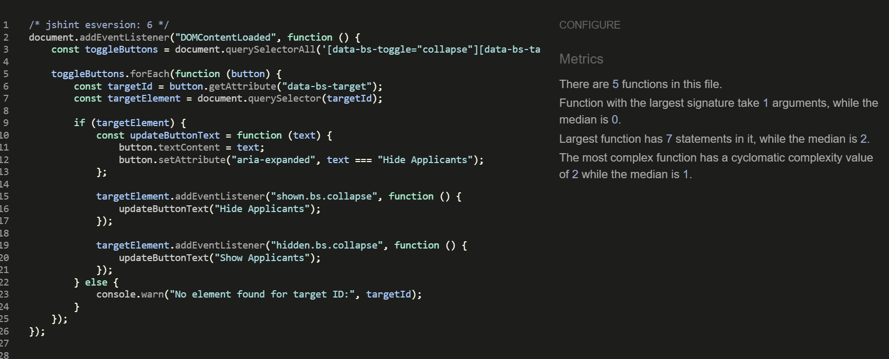

# TESTING

# Table of contents

- [TESTING](#testing)
- [Table of contents](#table-of-contents)
  - [User Story Testing](#user-story-testing)
  - [Unit Testing](#unit-testing)
  - [Validator Testing](#validator-testing)
  - [Browser Testing](#browser-testing)
  - [Device Testing](#device-testing)
  - [Unit Testing - Accounts Model](#unit-testing---accounts-model)
  - [Wave, Accessibility Testing](#wave-accessibility-testing)
  - [Manual Testing](#manual-testing)
  - [Home Page](#home-page)
  - [About Page](#about-page)
  - [Sailing Opportunities Page](#sailing-opportunities-page)
  - [Contact Page](#contact-page)
  - [Form Testing](#form-testing)
  - [Form Function Testing](#form-function-testing)
  - [Bugs](#bugs)

[TOC Generator Credit Luciopaiva](https://luciopaiva.com/markdown-toc/)

## User Story Testing

#### EPIC | User Registration, Approval And Authentication
  - As a user, I want to register for an account with the option to select my role as either a captain or a crew member so that I can specify my participation in trips.

  
  

    - AC-1 The registration form includes fields for username, email, password, and role selection.
    - AC-2 Role selection is limited to "Captain" or "Crew. With the addition of Administrator for testing"
    - AC-3 After successful registration, the user sees a message indicating that their account is pending admin approval.

- As an admin, I want to review new account registrations and approve or disapprove them so that only validated users can access the platform.

  
  

    - AC-1 Admin dashboard lists all pending accounts.
    - AC-2 Approved users are notified and gain access to the platform to complete their profile; disapproved users receive a notification.
      - User receives email at address provided, updating status changes

- As an approved user, I want to complete my profile by adding information about my experience level and a bio, so that others can understand my skills and background.

  

    - AC-1 After admin approval, the user gains access to the profile setup page.
    - AC-2 The profile form includes fields for experience level and a bio.
    - AC-3 Form is styled using Crispy Forms and Bootstrap.
    - AC-4 Data saves successfully to the profile, and changes are visible on the dashboard.

- As an approved user, I want to view my profile on my dashboard, so I can see the information I’ve shared and make updates as needed.

  

    - AC-1 Dashboard displays user profile with fields for bio and experience level.
    - AC-2 The Edit option is available to update profile details.
    - AC-3 Changes save and update immediately upon submission.

- As a returning user, I want to log in and log out of my account securely to access my profile and trip features.

  
  

    - AC-1 The login form includes fields for email/username and password, with clear labels for each.
    - AC-2 Upon successful login with valid credentials, the user is redirected to their dashboard.
    - AC-3 A Logout link is available in the navigation bar when the user is logged in.
    - AC-4 Upon logging out, the user is redirected to the homepage.
    - AC-5 If a logged-out user tries to access a restricted page (e.g., dashboard or profile), they are redirected to the login page.

#### EPIC | Trip Management

- As a captain, I want to create a sailing trip with details like title, location, date, and the number of crew needed, so I can recruit crew members for specific journeys.

  

    - AC-1 The trip creation form is only accessible to users with the "Captain" role.
    - AC-2 Form includes fields for title, location, date, and crew needed.
    - AC-3 Created trip appears on the captain’s dashboard under "My Trips."

- As a captain, I want to view a list of my created trips, so I can manage my upcoming trips and review participant status.

  

    - AC-1 Dashboard lists all trips created by the captain, sorted by date.

- As a captain, I want to view detailed information about each trip I create, including a list of crew members who have joined, so I can manage and organize my crew effectively.

  

    - AC-1 The Trip Details page displays trip information and a list of confirmed crew members.
    - AC-2 Option to approve or reject crew requests (if applicable).

#### EPIC | Joining Trips

- As a crew member, I want to view a list of available sailing trips, so I can decide which ones I’d like to join.

  

    - AC-1 Page that  displays a list of trips with open crew positions.
    - AC-2 Each trip entry includes title, location, date, and an option to request to join.

- As a crew member, I want to request to join a specific sailing trip, so I can participate and gain more experience.

  
  
  

    - AC-1 The join request option is available for crew members on the trip details page.
    - AC-2 Request updates the trip’s participant list as "Pending."
    - AC-3 Confirmation of successful join request appears on-screen.

- As a crew member, I want to view the trips I’ve joined on my dashboard, so I can keep track of my participation.

  

    - AC-1 Dashboard includes a "My Trips" section listing trips the user has joined.
    - AC-2 Trip status (e.g., Pending, Confirmed) displays for each entry.

- As a user, I want my experience to be tailored based on my role (captain or crew), so I only see actions and views relevant to my role.

  
  
  

    - AC-1 Captains have access to trip creation, management, and crew approval features.
      - Working
    - AC-2 Crew members have access to trip browsing and join request features.
      - Working
    - AC-3 Unauthorized users are redirected if attempting restricted actions.
      - Working

  #### EPIC | Role Based Access Control

  - As an admin, I want to manage user roles effectively, so I can control access to specific features.

  
  

    - AC-1 The admin panel includes options to view and modify user roles.
      - Working
    - AC-2 Role changes are saved and take immediate effect on user permissions.
      - Working

#### EPIC | Platform UI And Testing

- As a user, I want rich-text capabilities in my profile bio, so I can add more detailed information about myself.

  

    - AC-1 Bio field on the profile form supports rich-text formatting via Summernote.
      - Working, once approved user on first login has to complete bio.
    - AC-2 Bio content displays properly in the profile view on the dashboard.
      - Working. Can be updated as necessary

- As a user, I want the platform to have a clean and intuitive layout with easy navigation, so I can find features and complete actions quickly.

  - AC-1 Consistent styling across pages using Bootstrap and Crispy Forms.
    - Bootstrap and Cripsy forms have been implemented
  - AC-2 Navigation bar with links to key sections (dashboard, profile, trips).
    - Appropriate Navigation Is Available at all times
  - AC-3 All pages are mobile-friendly and responsive.
    - All pages tested for responsive design

#### EPIC | Static Pages

- As a visitor, I want an "About Us" page that describes the purpose of CrewFinder and the benefits of joining, so I can learn more about the platform.

  - AC-1 About Us page includes information on CrewFinder’s mission, team, and features.
    - All features visible
  - AC-2 Page is accessible from the navigation bar for all users.
    - Page Is Accessible from nav bar

- As a visitor, I want to see a welcoming home page that provides an overview of the CrewFinder platform, so I can understand the purpose and features of the app.

  - AC-1 Home page includes a brief description of CrewFinder, a call-to-action to join, and links to key pages (About Us, Sailing Opportunities, Contact Us).
    - Home page has hero introduction to set the scene with cta, then sections to help user buy into the site theme.
  - AC-2 Accessible from the navigation bar and visible to all users, including non-logged-in visitors.
    - Navigation is available to all users. Specific nav only accessible to logged in users

- As a visitor, I want a "Contact Us" page where I can find information on how to reach CrewFinder’s team, so I can ask questions or get support.

  
  
  

    - AC-1 Contact Us page includes a contact form with fields for name, email, and message, along with any relevant contact details.
      - Contact form has all necessary fields for filling in. Includes contact details.
    - AC-2 Submitting the form sends a message to the CrewFinder team and displays a confirmation to the user.

#### EPIC | Dynamic Pages

- As a visitor, I want to see a welcoming home page that provides an overview of the CrewFinder platform and displays the three latest trips, so I can see current opportunities and understand the purpose of the app.

  - AC-1 Home page includes a description of CrewFinder and links to key pages (About Us, Sailing Opportunities, Contact Us).
    - Complete and working
  - AC-2 The three latest trips are displayed dynamically, showing title, location, date, and a link to the trip details.
    - Complete and working
  - AC-3 Accessible from the navigation bar and visible to all users, including non-logged-in visitors.
    - Complete and working

- As a visitor, I want to view a "Sailing Opportunities" page with a list of all available trips, so I can browse sailing options before signing up.
  
  - AC-1 Sailing Opportunities page lists all active trips, showing titles, locations, dates, and number of crew needed.
    - Complete and working

- As a visitor, I want a login page where I can enter my credentials to access the platform, so I can reach my account and profile.

  - AC-1 Login page includes fields for email/username and password, along with a “Forgot Password?” option.
    - Complete and working
  - AC-2 Successful login redirects to the user dashboard.
    - Complete and working

#### EPIC | Deployment And Testing

- As a developer, I want to deploy the app to Heroku frequently, so I can verify that each feature works as expected in a production-like environment.

  - AC-1 Initial deployment to Heroku occurs on Day 1.
    - Deployed
  - AC-2 Subsequent features are deployed to Heroku and verified after implementation.
    - Repeated deployments through development cycle

- As a developer, I want to configure Whitenoise for static file handling, so I can manage CSS and JavaScript assets effectively in production.

  - AC-1 Whitenoise is installed and configured to handle static files on Heroku.
    - Configured and working
  - AC-2 Static assets load correctly and are accessible in the production environment.
    - Static files all updated and loaded in production environment

- As a developer, I want to write unit tests for critical models and views, so I can ensure the app behaves as expected.

  - AC-1 Key models (e.g., Account, SailingTrip, CrewBooking) have associated unit tests.
  - AC-2 Critical views (e.g., registration, trip creation) are tested for expected behaviour.

## Unit Testing

##### Accounts App Testing
- Unit Testing Accounts Model Result

  

## Validator Testing

### HTML

All HTML pages were run through the [W3C HTML Validator](https://validator.w3.org/). See results in below table.

| Page                       | Logged Out |  Logged In  |
|----------------------------|------------|-------------|
| base.html                  | No errors  |   No Errors |
| home.html                  | No errors  |   No Errors |
| login.html                 | No errors  |   NA        |
| signup.html                | No errors  |   NA        |
| password_reset.html        | No errors  |   NA        |
| sailing_opportunities.html | No errors  |   No errors |
| contact.html               | No errors  |   No errors |
| about.html                 | No errors  |   No errors |
| admin_dashboard.html       | NA         |   No errors |
| dashboard.html             | NA         |   No errors |
| update_profile.html        | NA         |   No Errors |
| registration_pending.html  | No Errors  |   NA        |
| edit_user.html             | NA         |   No Errors |
| crew_profile.html          | NA         |   No Errors |
| complete_profile.html      | NA         |   No Errors |
| 400.html                   | No errors  |   NA        |
| 403.html                   | No errors  |   NA        |
| 404.html                   | No errors  |   NA        |
| 500.html                   | No errors  |   NA        |

### CSS

No errors were found when passing my CSS file through the official [W3C CSS Validator](https://jigsaw.w3.org/css-validator/)

 

 
CSS

 

 ### Javascript

### Javascript
No errors were found when passing my javascript through [Jshint](https://jshint.com/) 

Jshint

### Python

All Python files were run through [Pep8](https://pep8ci.herokuapp.com/)  with no errors found.

### Lighthouse

Lighthouse validation was run on all pages (both mobile and desktop) in order to check accessibility and performance.

| Page                    | Performance  | Accessibility | Best Practices  |  SEO  |
|-------------------------|:------------:|:-------------:|:---------------:|:-----:|
|                         |              |               |                 |       |
| **Desktop**             |              |               |                 |       |
| Home                    |          94  |            93 |             100 | 91    |
| Sign Up                 |          100 |           100 |             100 | 90    |
| Password Reset          |          99  |           100 |             100 | 90    |
| Login                   |          99  |           100 |             100 | 90    |
| About Us                |          100 |            93 |             100 | 91    |
| Contact Us              |          99  |           100 |             100 | 90    |
| Sailing Opportunities   |          98  |            93 |              96 | 91    |
| Admin Dashboard         |          100 |           100 |             100 | 90    |
| Authorise User          |          100 |            95 |              96 | 91    |
| Captain Dashboard       |          99  |            95 |              96 | 91    |
| Update Profile          |          100 |            93 |             100 | 91    |
| Create Trip             |          100 |            93 |             100 | 91    |
|                         |              |               |                 |       |
| **Mobile**                   |              |               |                 |       |
| Home                    |          97  |            93 |             96 | 91    |
| Sign Up                 |          93 |           100 |             100 | 90    |
| Password Reset          |          90  |           100 |             100 | 90    |
| Login                   |          90 |           100 |             100 | 90    |
| About Us                |          96 |            98 |             96 | 91    |
| Contact Us              |          95  |           100 |             100 | 90    |
| Sailing Opportunities   |          95  |            98 |              96 | 91    |
| Admin Dashboard         |          100 |           100 |             100 | 90    |
| Authorise User          |          100 |            95 |              96 | 91    |
| Captain Dashboard       |          99  |            95 |              96 | 91    |
| Update Profile          |          100 |            93 |             100 | 91    |
| Create Trip             |          100 |            93 |             100 | 91    |

## Browser Testing
- The Website was tested on Google Chrome, Firefox, Edge browsers with no issues noted.

## Device Testing
- The website was viewed on a variety of devices such as Desktop, Laptop, Tablet and Mobile Phones to ensure responsiveness on various screen sizes in both portrait and landscape mode. The website performed as intended. The responsive design was also checked using Chrome developer tools across multiple devices with structural integrity holding for the various sizes.

## Unit Testing - Accounts Model

Test Explained

The `UserModelTest` is a comprehensive test suite for the custom `User` model in the `accounts` app. It ensures that the model's functionality aligns with the application's requirements, covering default values, role behavior, approval status logic, and custom fields.

### Purpose of the Test Suite

The `UserModelTest` validates the following:
- Default field values are correctly set.
- Role and approval status behave as expected.
- The `is_active` field updates dynamically based on `approval_status`.
- Custom fields like `experience` and `photo` work as intended.
- The model's string representation is appropriate.

---

### Test Cases

#### 1. **`test_default_values`**
- **Purpose:** Ensures default values for fields are correctly set.
- **Assertions:**
  - `role` defaults to `'crew'`.
  - `approval_status` defaults to `'pending'`.
  - `is_active` defaults to `False`.
  - `experience` defaults to `'None'`.

#### 2. **`test_role_choices`**
- **Purpose:** Verifies the `role` field accepts valid role choices.
- **Assertions:**
  - Valid roles: `'captain'`, `'crew'`, and `'administrator'`.

#### 3. **`test_approval_status_behavior`**
- **Purpose:** Ensures the `is_active` field reflects the `approval_status` field.
- **Assertions:**
  - `is_active` is `True` for `approved` users.
  - `is_active` is `False` for `pending` and `disapproved` users.
  - Changes to `approval_status` dynamically update `is_active`.

#### 4. **`test_experience_choices`**
- **Purpose:** Verifies the `experience` field handles valid choices.
- **Assertions:**
  - Accepts values like `'RYA Dayskipper'`.

#### 5. **`test_string_representation`**
- **Purpose:** Tests the `__str__` method of the `User` model.
- **Assertions:**
  - Returns the `username` as the string representation.

#### 6. **`test_profile_photo_field`**
- **Purpose:** Ensures the `photo` field can handle optional and updated values.
- **Assertions:**
  - Defaults to `None`.
  - Can be updated with a valid file path.

---

### Test Data Setup

The `setUp` method initializes three sample users for testing:
- **Captain User:** Role set to `captain` with `approved` status.
- **Crew User:** Role set to `crew` with `pending` status.
- **Admin User:** Role set to `administrator` with `disapproved` status.

This setup ensures consistent and reusable test data across test cases.

---

Test Restuls

## Wave, Accessibility Testing
- The Website was tested using Wave. No Errors were found.

## Manual Testing

### Site Navigation
| Element                      | Action     | Expected Result                                                    | Pass/Fail |
|------------------------------|------------|--------------------------------------------------------------------|-----------|
| NavBar                       |            |                                                                    |           |
| Site Name (logo area)        | Click      | Redirect to home                                                   | Pass      |
| Site Name (logo area)        | Hover      | Color Change                                                       | Pass      |
| Signup Link                  | Click      | Open Signup Page                                                   | Pass      |
| Signup Link                  | Hover      | Color Change                                                       | Pass      |
| Login Link                   | Click      | Open Login Page                                                    | Pass      |
| Login Link                   | Hover      | Color Change                                                       | Pass      |
| Hamburger Menu Link          | Click      | Menu Dropdown                                                      | Pass      |
| Home Link                    | Click      | Opens Home Page                                                    | Pass      |
| Home Link                    | Hover      | Color Change                                                       | Pass      |
| About Us Link                | Click      | Opens About Us Page                                                | Pass      |
| About Us Link                | Hover      | Color Change                                                       | Pass      |
| Contact Us Link              | Click      | Opens Contact Us Page                                              | Pass      |
| Contact Us Link              | Hover      | Color Change                                                       | Pass      |
| Sailing Opportunities Link   | Click      | Opens Sailing Opportunities Page                                   | Pass      |
| Sailing Opportunities Link   | Hover      | Color Change                                                       | Pass      |
| Mobile View                  |            |                                                                    |           |
| Site Name (logo area)        | Click      | Redirect to home                                                   | Pass      |
| Hamburger Menu Link          | Click      | Menu Dropdown                                                      | Pass      |
| Signup Link                  | Click      | Open Signup Page                                                   | Pass      |
| Login Link                   | Click      | Open Login Page                                                    | Pass      |
| Home Link                    | Click      | Opens Home Page                                                    | Pass      |
| About Us Link                | Click      | Opens About Us Page                                                | Pass      |
| Contact Us Link              | Click      | Opens Contact Us Page                                              | Pass      |
| Sailing Opportunities Link   | Click      | Opens Sailing Opportunities Page                                   | Pass      |

## Home Page
| Element                                                          | Action     | Expected Result                               | Pass/Fail |
|------------------------------------------------------------------|------------|-----------------------------------------------|-----------|
| Home Page                                                        |            |                                               |           |
| Hero Section CTA                                                 |   Click    |        Redirect to signup page                | Pass      |
| About Crewfinder CTA                                             |   Click    |        Redirect to signup page                | Pass      |
| Latest Sailing Opportunities Login CTA                           |   Click    |        Redirect to login page                 | Pass      |
| Latest Sailing Opportunities Signup CTA                          |   Click    |        Redirect to signup page                | Pass      |
| Ready To Sail Footer Section View All Sailing Opportunities CTA  |   Click    |        Redirect to Sailing Opportunities Page | Pass      |
| Ready To Sail Footer Section Signup CTA                          |   Click    |        Redirect to signup page                | Pass      |
| Latest Sailing Opportunities                                     |   Hover    |        Card Rises Up On Hover                 | Pass      |
| Latest Sailing Opportunities                                     |   Order    |        Last 3 Trips Sorted By Time            | Pass      |
| Latest Sailing Opportunities                                     |   View     |        Only 3 Trips Shown                     | Pass      |
| Testimonials                                                     |   View     |        Only 2 Trips Shown                     | Pass      |
| Testimonials                                                     |   Rotation |        Testimonials Rotate                    | Pass      |

## About Page

| Element                           | Action     | Expected Result                                      | Pass/Fail |
|-----------------------------------|------------|------------------------------------------------------|-----------|
| About  Page                       |            |                                                      |           |
| Join Crewfinder Signup CTA        |   Click    |        Redirect to signup page                       | Pass      |
| Join Crewfinder Signup CTA        |   Hover    |        Button Hover Effect, grow, bg color change    | Pass      |
| View Sailing Opportunities CTA    |   Click    |        Redirect to Sailing Opportunities Page        | Pass      |
| View Sailing Opportunities CTA    |   Hover    |        Button Hover Effect, bg color change          | Pass      |

## Sailing Opportunities Page

| Element                           | Action     | Expected Result                                      | Pass/Fail |
|-----------------------------------|------------|------------------------------------------------------|-----------|
| Sailing Opportunities  Page       |            |                                                      |           |
| Trip Card                         |   Hover    |        Hover effect, card rises                      | Pass      |
| Trip Card - Login Button          |   Display  |        Login To Apply Button Visible                 | Pass      |
| Trip Card - Signup Button         |   Display  |        Signup To Apply Button Visible                | Pass      |
| Trip Card - Already Applied       |   Display  |        Logged In: Already Applied If Appropriate     | Pass      |
| Trip Card - Apply                 |   Display  |        Logged In: Apply           If Appropriate     | Pass      |
| Join Crewfinder Signup CTA        |   Hover    |        Button Hover Effect, grow, bg color change    | Pass      |
| View Sailing Opportunities CTA    |   Click    |        Redirect to Sailing Opportunities Page        | Pass      |
| View Sailing Opportunities CTA    |   Hover    |        Button Hover Effect, bg color change          | Pass      |

## Contact Page

| Element                         | Action     | Expected Result                                                    | Pass/Fail |
|---------------------------------|------------|--------------------------------------------------------------------|-----------|
| Contact Page                    |            |                                                                    |           |
| Name Label  - Field             |   Display  |        Form Name Label And Field Visible                           | Pass      |
| Email Label  - Field            |   Display  |        Email Label And Field Visible                               | Pass      |
| Message Label  - Field          |   Display  |        Message Label And Field Visible                             | Pass      |
| Submit Button                   |   Hover    |        Hover effect, grow                                          | Pass      |
| Submit Button                   |   Click    |        If Empty, warning field needs to be filled                  | Pass      |

## Form Testing

### Signup Form
| Element                         | Action     | Expected Result                                                    | Pass/Fail |
|---------------------------------|------------|--------------------------------------------------------------------|-----------|
| Signup Form                     |            |                                                                    |           |
| Username Label  - Field         |   Display  |        Username Label And Field Visible                            | Pass      |
| Email Label  - Field            |   Display  |        Email Label And Field Visible    Required                   | Pass      |
| Role    Label  - Field          |   Click    |        Options, Captain, Crew, Administrator                       | Pass      |
| Password Label - Field          |   Display  |        Must Comply with auth requirements                          | Pass      |
| Password Label - Field - Repeat |   Display  |        Must Comply with auth requirements                          | Pass      |

### Login Form
| Element                         | Action     | Expected Result                                                    | Pass/Fail |
|---------------------------------|------------|--------------------------------------------------------------------|-----------|
| Login  Form                     |            |                                                                    |           |
| Username Label  - Field         |   Display  |        Username Label And Field Visible                            | Pass      |
| Password Label - Field          |   Display  |        Password Label and Field Visible                            | Pass      |
| Signup Option - Link            |   Display  |        Option To Signup Visible                                    | Pass      |
| Signup Option - Link            |   Click    |        Redirect To Signup Form                                     | Pass      |
| Forgot Password - Link          |   Display  |        Redirect Link To Password Reset Visible                     | Pass      |
| Forgot Password - Link          |   Click    |        Redirect To Password Reset Visible                          | Pass      |

### Password Reset Form
| Element                         | Action     | Expected Result                                                    | Pass/Fail |
|---------------------------------|------------|--------------------------------------------------------------------|-----------|
| Password Reset Form             |            |                                                                    |           |
| Email Address Label  - Field    |   Display  |       Email Address Label And Field Visible                        | Pass      |
| Send Reset Link Button          |   Hover    |       Button Action, enlarge                                       | Pass      |

## Form Function Testing

### Signup Form

| User Name | Email Address | Role          | Password | Password Again | Expected Output             | Pass/Fail |
|-----------|---------------|---------------|----------|----------------|-----------------------------|-----------|
| -         | X             | Captain       | X        | X              | Please Fill Out This Field  | Pass      |
| X         | -             | Captain       | X        | X              | Email Cannot Be Blank       | Pass      |
| X         | X             | Captain       | -        | X              | Please Fill Out This Field  | Pass      |
| X         | X             | Captain       | X        | -              | Please Fill Out This Field  | Pass      |
| X         | X             | Captain       | X        | X              | Redirect to thank you page  | Pass      |
| -         | X             | Crew          | X        | X              | Please Fill Out This  Field | Pass      |
| X         | -             | Crew          | X        | X              | Email Cannot Be Blank       | Pass      |
| X         | X             | Crew          | -        | X              | Please Fill Out This Field  | Pass      |
| X         | X             | Crew          | X        | -              | Please Fill Out This Field  | Pass      |
| X         | X             | Crew          | X        | X              | Redirect to thank you page  | Pass      |
| -         | X             | Administrator | X        | X              | Please Fill Out This  Field | Pass      |
| X         | -             | Administrator | X        | X              | Email Cannot Be Blank       | Pass      |
| X         | X             | Administrator | -        | X              | Please Fill Out This Field  | Pass      |
| X         | X             | Administrator | X        | -              | Please Fill Out This Field  | Pass      |
| X         | X             | Administrator | X        | X              | Redirect to thank you page  | Pass      |

| Link                                 | Action | Expected Output        | Pass/Fail |
|--------------------------------------|--------|------------------------|-----------|
| Already Have An Account, Login Here  | Click  | Redirect To Login Page | Pass      |

------ 

### Login Form

| User Name | Password | Expected Output            | Pass/Fail |
|-----------|----------|----------------------------|-----------|
| X         | -        | Please Fill Out This Field | Pass      |
| -         | X        | Please Fill Out This Field | Pass      |

| Link                               | Action | Expected Output                 | Pass/Fail |
|------------------------------------|--------|---------------------------------|-----------|
| Dont Have An Account, Signup Here  | Click  | Redirect To Signup Page         | Pass      |
| Forgot Your Password               | Click  | Redirect To Password Reset Page | Pass      |

-------

### Password Reset Page

| Link                                | Action | Expected Output        | Pass/Fail |
|-------------------------------------|--------|------------------------|-----------|
| Already Have An Account, Login Here | Click  | Redirect To Login Page | Pass      |

------

### Functional Administrator Login Test

| Link                                | Action | Expected Output        | Pass/Fail |
|-------------------------------------|--------|------------------------|-----------|
| From Home Page Click Login In Menu | Click  | Redirect To Login Page | Pass      |

- User Name: kevin
- Password: Drumph34!

| Element                  | Action          | Expected Result                                                                                                            | Pass/Fail |
|--------------------------|-----------------|----------------------------------------------------------------------------------------------------------------------------|-----------|
| Admin Dashboard          | Display         | Table With All Captain/Crew Users                                                                                          | Pass      |
| Username                 | Display         | Display Username of user                                                                                                   | Pass      |
| Email                    | Display         | Email user by user signed up                                                                                               | Pass      |
| Role                     | Display         | Role Defined by user at signup                                                                                             | Pass      |
| Status                   | Display         | Active / Inactive / Pending                                                                                                | Pass      |
| Action                   | Display         | Edit Link                                                                                                                  | Pass      |
| Edit Link                | Click           | Open User Edit Form                                                                                                        | Pass      |
| Edit User Form           | Display         | All Details Of User Visible                                                                                                | Pass      |
| Username                 | Display         | Cannot Edit                                                                                                                | Pass      |
| Email                    | Display         | Cannot Edit                                                                                                                | Pass      |
| Role                     | Click           | Dropdown With Options, Captain, Crew, Administrator                                                                        | Pass      |
| Approval Status          | Click           | Dropdown With Options, Pending, Approved, Declined                                                                         | Pass      |
| Approval Status Approved | Select And Save | User Gets Updated Email From Signup Address Advising Of Status Change                                                      | Pass      |
| Approval Status Pending  | Select And Save | User Gets Updated Email From Signup Address Advising Of Status Change                                                      | Pass      |
| Approval Status Declined | Select And Save | User Gets Updated Email From Signup Address Advising Of Status Change                                                      | Pass      |
| Experience               | Display         | Dropdown With Options, None, RYA: Competent Crew, Dayskipper, Yachtmaster Coastal, Yachtmaster Offshore, Yachtmaster Ocean | Pass      |
| Photo                    | Display         | On First Visit A Default Photo Is Provided, The User Will Not Have Uploaded Their Own Awaiting Apprval                     | Pass      |
| Save Button              | Click           | Returns To Administrator Dashboard With Updated Changes Saved                                                              | Pass      |
| Cancel Button            | Click           | Return To Administrator Dashboard With No Updated Changes Saved                                                            | Pass      |
| Logout Button            | Click           | Logout User And Return To Home Page                                                                                        | Pass      |

### Functional Captain Login Test

| Link                                | Action | Expected Output        | Pass/Fail |
|-------------------------------------|--------|------------------------|-----------|
| From Home Page Click Login In Menu | Click  | Redirect To Login Page | Pass      |

- User Name: ken
- Password: Drumph34!

| Element                                            | Action                                | Expected Result                                                                                                                             | Pass/Fail |
|----------------------------------------------------|---------------------------------------|---------------------------------------------------------------------------------------------------------------------------------------------|-----------|
| Captain Dashboard                                  | Display                               | Dashboard With Buttons For Update Profile & Create Trip With Cards Showing Trips Created Or Message Saying No Trips                         | Pass      |
| Update Profile                                     | Click                                 | Redirected To Profile Page For Updating                                                                                                     | Pass      |
| Bio                                                | Update & Save                         | Saves Changes Made In Bio Field And Redirects To Captain Dashboard                                                                          | Pass      |
| Experience                                         | Change Expierience & Save             | Saves Experience And Redirects To Captains Dashboard                                                                                        | Pass      |
| Save Changes Button                                | Click                                 | Saves Changes And Redirects To Captains Dashboard With Any Changes Saved                                                                    | Pass      |
| Cancel Button                                      | Click                                 | Redirects To Captains Dashboard Without Any Changes Saved                                                                                   | Pass      |
| Create New Trip Button                             | Click                                 | Opens A Trip Creation Form                                                                                                                  | Pass      |
| Trip Creation Form Trip Title                      | Display                               | Trip Title Field Visible Required                                                                                                           | Pass      |
| Trip Creation Form Trip Title                      | Enter Title Only And Save             | Please Fill Out This Field Warning                                                                                                          | Pass      |
| Trip Creation Form Departing From                  | Display                               | Departing From Field Visible                                                                                                                | Pass      |
| Trip Creation Form Departing From                  | Enter Departing Only And Save         | Please Fill Out This Field Warning                                                                                                          | Pass      |
| Trip Creation Form Arriving At                     | Display                               | Arriving At Field Visible                                                                                                                   | Pass      |
| Trip Creation Form Arriving At                     | Enter Arriving At Only                | Please Fill Out This Field Warning                                                                                                          | Pass      |
| Trip Creation Form Departure Date                  | Display                               | Departure Date - Date Selector Select Date                                                                                                  | Pass      |
| Trip Creation Form Departure Date                  | Leave Empty And Save                  | Please Fil Out This Field Warning                                                                                                           | Pass      |
| Trip Creation Form Duration                        | Display                               | Duration Field Visible                                                                                                                      | Pass      |
| Trip Creation Form Duration                        | Enter Duration Only                   | Please Fill Out This Field Warning                                                                                                          | Pass      |
| Trip Creation Form Crew Needed                     | Display                               | Crew Needed Field Visible                                                                                                                   | Pass      |
| Trip Creation Form Crew Needed                     | Enter Crew Needed Only                | Please Fill Out This Field Warning                                                                                                          | Pass      |
| Trip Creation Form Boat Name                       | Display                               | Boat Name Field Visible                                                                                                                     | Pass      |
| Trip Creation Form Boat Name                       | Enter Boat Name Only                  | Please Fill Out This Field Warning                                                                                                          | Pass      |
| Trip Creation Form Boat Description                | Display                               | Boat Description Field Visible                                                                                                              | Pass      |
| Trip Creation Form Boat Description                | Enter Boat Name Or Leave Empty        | No Error - Not Required                                                                                                                     | Pass      |
| Trip Creation Form Trip Description                | Display                               | Trip Desciriptio Field Visible                                                                                                              | Pass      |
| Trip Creation Form Trip Description                | Enter Trip Description Or Leave Empty | No Error - Not Required                                                                                                                     | Pass      |
| Trip Creation Form Boat Image                      | Display                               | Blank Place Holder Visible                                                                                                                  | Pass      |
| Trip Creation Form Boat Image                      | Leave Empty                           | No Error, Fallback Image Saved                                                                                                              | Pass      |
| Required Fields with *                             | Leave Empty                           | Warning on first field message. All required fields must be filled in                                                                       | Pass      |
| Save Button                                        | Click                                 | Saves Trip And Returns To Captains Dashboard                                                                                                | Pass      |
| Cancel Button                                      | Click                                 | Returns To Captains Dashboard                                                                                                               | Pass      |
| Trip Card                                          | Display                               | Displays Image, fallback image if none provided and details about trip                                                                      | Pass      |
| Trip Card Edit Button                              | Click                                 | Opens Trip Form With Trip Details                                                                                                           | Pass      |
| Edit Trip Form                                     | Display                               | All Trip Details Visible                                                                                                                    | Pass      |
| Edit Trip Form - Change Title                      | Change & Save                         | Trip Title Changes And Saved                                                                                                                | Pass      |
| Edit Trip Form - Change Departing From             | Change & Save                         | Departing From Changed And Saved                                                                                                            | Pass      |
| Edit Trip Form - Change Arriving At                | Change & Save                         | Arriving At Changed And Saved                                                                                                               | Pass      |
| Edit Trip Form - Change Departure Date             | Change & Save                         | Departure Date Changed And Saved                                                                                                            | Pass      |
| Edit Trip Form - Change Duration                   | Change & Save                         | Duration Changed And Saved                                                                                                                  | Pass      |
| Edit Trip Form - Crew Needed                       | Change & Save                         | Crew Needed Changed And Saved                                                                                                               | Pass      |
| Edit Trip Form - Boat Name                         | Change & Save                         | Boat Name Changed And Saved                                                                                                                 | Pass      |
| Edit Trip Form - Boat Description                  | Change & Save                         | Boat Description Changed And Saved                                                                                                          | Pass      |
| Edit Trip Form - Trip Description                  | Change & Save                         | Trip Description Changed And Saved                                                                                                          | Pass      |
| Edit Trip Form - Boat Image                        | Change & Save                         | Image Changed And Saved                                                                                                                     | Pass      |
| Delete Button                                      | Click                                 | Redirect To Delete Confirmation Page                                                                                                        | Pass      |
| Delete Trip Confirmation Form                      | View                                  | Display Trip Details And Delete Buttons                                                                                                     | Pass      |
| Delete Trip Confirmation Form - Cancel Button      | Click                                 | Return To Captain Dashboard Without Deleting Trip                                                                                           | Pass      |
| Delete Trip Confirmation Form - Delete Trip Button | Click                                 | Return To Captain Dashboard With Trip Deleted                                                                                               | Pass      |
| Applicants Tab In Trip Card - No Applicants        | Display                               |  No Applicants For This Trip Yet                                                                                                            | Pass      |
| Applicants Tab In Trip Card - Applicant Applied    | Display                               | Username Displayed And View Profile Button                                                                                                  | Pass      |
| Applicants Tab In Trip Card - View Profile         | Click                                 | View User Profile For Opens                                                                                                                 | Pass      |
| View User Profile Form                             | Display                               | User Profile Details With Status Dropdown                                                                                                   | Pass      |
| View User Profile Form - Status Change             | Confirmed And Save                    | Return To Dashboard And See Crew Member Status Updated. Send Status Update To Crew Member, Reduce Crew Needed                               | Pass      |
| View User Profile Form - Status Change             | Declined And Save                     | Return To Dashboard And See Crew Member Status Updated. Send Status Update To Crew Member, Increase Crew Needed If Already Accepted         | Pass      |
| View User Profile Form - Status Change             | Pending And Save                      | This is the default status, but can be changed from confirmed or declined. Message Sent To Crew Member, Crew Needed Incremented If Possible | Pass      |
| View User Profile Form - Cancel Button             | Click                                 | Return To Captain Dashboard, No Changes Saved                                                                                               | Pass      |
| View User Profile Form - Update Status Button      | Click                                 | Returns To Captain Dashboard, Saves Any Change To Status Made                                                                               | Pass      |

### Functional Crew Login Test
| Element                                                             | Action                    | Expected Result                                                                                           | Pass/Fail |
|---------------------------------------------------------------------|---------------------------|-----------------------------------------------------------------------------------------------------------|-----------|
| Crew Dashboard                                                      | Display                   | Dashboard With Buttons For Update Profile & View Sailing Opportunities, Trips Applied For And Status      | Pass      |
| Update Profile                                                      | Click                     | Redirected To Profile Page For Updating                                                                   | Pass      |
| Bio                                                                 | Update & Save             | Saves Changes Made In Bio Field And Redirects To Captain Dashboard                                        | Pass      |
| Experience                                                          | Change Expierience & Save | Saves Experience And Redirects To Captains Dashboard                                                      | Pass      |
| Save Changes Button                                                 | Click                     | Saves Changes And Redirects To Captains Dashboard With Any Changes Saved                                  | Pass      |
| Cancel Button                                                       | Click                     | Redirects To Captains Dashboard Without Any Changes Saved                                                 | Pass      |
| Create New Trip Button                                              | Click                     | Opens A Trip Creation Form                                                                                | Pass      |
| View Sailing Opportunities Button                                   | Click                     | Redirects To Sailing Opportunities Page On Site                                                           | Pass      |
| Sailing Opportunities Page - Logged In                              | View                      | All Trips Available Sorted By Latest Posted                                                               | Pass      |
| Sailing Opportunities Page - Logged In                              | View                      | Trip Cards Have A Status "You have already applied for this trip" if you have applied                     | Pass      |
| Sailing Opportunities Page - Logged In                              | View                      | Trip Cards Have A Button "Apply For This Trip" If You havent Applied                                      | Pass      |
| Sailing Opportunities Page - Logged Out                             | View                      | Login To Apply & Signup To Apply Buttons                                                                  | Pass      |
| Sailing Opportunities Page - Logged In - Apply For This Trip Button | Click                     | User Redirected To Dashboard With Listed Trip And Satus Pending                                           | Pass      |
| Sailing Opportunities Page - Logged In - Trip Applied For, Status   | View                      | Status "Already Applied For"                                                                              | Pass      |
| Dashboard - Trip Status                                             | View                      | Status Changes As Captain Reviews Application - Pending - Approved - Declined                             | Pass      |
| Dashboard On First Visit                                            | View                      | "You Have Not Applied For Any Trips Yet"                                                                  | Pass      |
| Dashboard On Subsequent Visits After Applying For Trips             | View                      | All Trips Applied For Sorted By Due Date                                                                  | Pass      |
| Trip Cards Details                                                  | View                      | Image, Departing, Departure Date, Boat Name, Arriving At, Duration, Crew Needed, Image                    | Pass      |
| Trip Card Details - Crew Needed                                     | View                      | Increments And Decrements As Captain Approves Or Declines Crew Applications                               | Pass      |
| Trip Card Details - Delete Button                                   | Click                     | Deletes Application, Removes Trip From Dashboard, Increments Crew Needed, Adds Back To Opportunities Page | Pass      |
| Logout Button                                                       | Click                     | Returns To Home Page                                                                                      | Pass      |

-----

## Bugs

### Fixed Bugs

After adding  trips, when running in browser:

- Error: AttributeError: module 'trips.views' has no attribute 'create_trip'
- Solution: Add placeholder view for trips

After adding  acounts, when running in browser:

- Error: AttributeError: module 'accounts.views' has no attribute 'signup'
- Solution: Add placeholder view for accounts

Styling ok in gitpod but missing on Heroku

- Error: admin page styling ok in Gitpod but not on Heroku
- Solution: Added whitenoise to serve static files

Captain Logged In Cant View Created Trips

- Problem:     Captain logged in cant view trips they created.
- Solution:    Dashboard view created in wrong app. Was in trips, moved to acctouns.

Default profile pic not loading.. missing image and just alt text

- Problem: incorrect path to static image in template
- Solution: corrected the image path.

When creating a trip and clicking on cancel, i get a 500 error.

- Problem: Captains dashboard view for trips is looking for field called date
- Solution: change field being called from date to departure_date

When crew apply, their application doesnt show in captain dashboard.

- Problem: Captains dashboard should update with crew applications
- Solution: update signals file and changed crewbooking model to set default status

Captains dashboard creates console error mixed content. https served as http from cloudinary
- On the captains dashboard, cloudniary images are being served with http instead of https
- Solution: create filter and convert http to https forcing serving of https images

